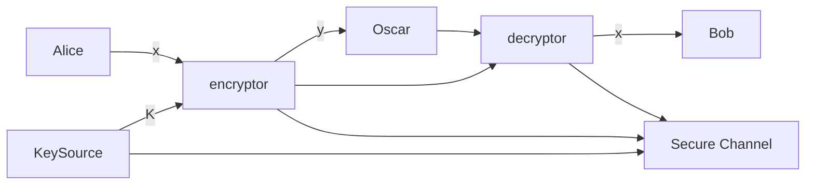

I begun reading the `Cryptography Theory and Practice` book by Stinson & Paterson
and I figured I would take notes, for those inclined to learn more about
cryptography. As a background, I am not a cryptographer. I'm an applier of
cryptography. So everything here will come from the lens of someone trying to
understand "how do I use this".

<!-- more -->

<!-- markdown-toc start - Don't edit this section. Run M-x markdown-toc-refresh-toc -->

**Table of Contents**

- [Public Private Key Encryption](#public-private-key-encryption)
  - [Basic Crypto Systems](#basic-crypto-systems)
  - [Hybrid Cryptography](#hybrid-cryptography)
  - [Message Integrity](#message-integrity)
  - [Message Authentication Codes (MAC)](#message-authentication-codes-mac)
  - [Signature Schemes](#signature-schemes)
  - [Nonrepudiation](#nonrepudiation)
  - [Certificates](#certificates)
  - [Hashing](#hashing)
  - [Cryptographic Protocols](#cryptographic-protocols)
  - [Security](#security)
  - [Notes and References](#notes-and-references)
- [Classical Cryptography](#classical-cryptography)
  - [Introduction](#introduction)
  - [Shift Cipher](#shift-cipher)

<!-- markdown-toc end -->

### Public Private Key Encryption

#### Basic Crypto Systems

- In public private key encryption, a public key is used to encrypt the plaintext
  and the priate key is used to decrypt the text. The most widely known crypto
  system is RSA, invented by Rivest, Shamir and Adleman.
- Cryptosystems are usually categorized as block ciphers or stream ciphers.
  - Block cipher
    - Plain text is divided into fixed chunks a.k.a. **blocks**
    - Block is specified to be a bitstring of some length
    - Cipher will decrypt or encrypt one block at a time.
  - Stream Cipher
    - Constructs a key stream: a bitstring that has same length as the plaintext
    - Operation constructs the ciphertext as the exclusive-or of the plaintext
      and the keystream
    - Decryption is accomplished by computing the exclusive-or of the ciphertext
      and the keystream
  - Public-key cryptosystems are invariably block ciphers, while secret-key
    cryptosystems can be block ciphers or stream ciphers

#### Hybrid Cryptography

This method speeds up the drawbacks of slower public-key cryptosystems.

- Public key encryption for a short shared secret key
- Secret key encryption is used to encrypt longer plain text

#### Message Integrity

- Secrecy == confidentiality
- Passive adversary ( can only listen in, but not alter data )
- Active adversary ( can alter, inpersonate, or divert information across a flow )
  - Mention of **bit-flipping attacks** as impacting stream ciphers
- Message Authentication Code (MAC) : secret key settings
- Public Key Settings use Signature Scheme. Roughly the same.

#### Message Authentication Codes (MAC)

- Alice uses a _secret key_ to create a _tag_ that she appends to the message
  (depends on both key and message).
- Bob uses the tag to re-compute the tag and checks to see if it is the same as
  the tag that he received.
- A variant is _encrypted-then-MAC_: Encrypt first, then tag

#### Signature Schemes

- Private key specifies a signing algo that can be used to sign messages.
- Output is called a signature
- Sign(msg, key)
- Verify(msg, signature)
- Anyone can verify signature
- It is infeasible for an adversary to create a signature
- Commonly used in software updates
- _sign-then-encrypt_ the reverse of _*encrypted-then-MAC*_

#### Nonrepudiation

- The concept not be able to take back a signature
- MAC is deniable and does not secure against repudiation.
- allows for secret conversation

#### Certificates

- Contains a websites public keys
- TA public key is typically hard coded into browser

#### Hashing

- Compresses arbirtrary length string into a fixed length `message-digest`
- After hash, signs the message digest `hash-then-sign`. Verification happens by
  comparing digest, then verification algorithm to check the validity of the
  signatures. `hash-then-sign-then-encrypt`.
- The crytographic hash is very different than a hash table:
  - hashtable: unprobable collisions
  - cryptographic: computationally infeasible to find collisions
- Cryptographic hashes can be used for key derivation
  - Hash applied to a long string to create a short random key
- Can't be used for encryption: no key and non-invertible/non-injective

#### Cryptographic Protocols

- `protocol`: sequence of messages exchanged between two parties
- `session`: consists of one or many flows
- `identification scheme`: identity proof
- `key distribution scheme`: keys chosen by a trusted authority
- `key agreement` derived
- `secret sharing scheme` : involves a trusted authority distributing “pieces”
  of information (called “shares”) in such a way that certain subsets of shares
  can be suitably combined to reconstruct a certain predefined secret.
  - `threshold scheme`: (k,n)-threshold there are n shares and k permit
    reconstruction of the secret

#### Security

- attack model, adversarial goal, and security level
- attack model: assumes information available to adversary
  - We will always assume that the adversary knows the scheme or protocol being
    used (this is called Kerckhoffs’ Principle).The adversary is also assumed to
    know the public key (if the system is a public-key system). On the other
    hand, the adversary is assumed not to know any secret or private keys being
    used
- adversarial goal: what does it mean for an attacker to be successful
- security level: qualify the effort to break the system
- 4 attack models:
  - `known ciphertext attack`: the adversary has access to some amount of
    ciphertext that is all encrypted with the same unknown key.
  - In a `known plaintext attack`, the adversary gains access to some plaintext as
    well as the corresponding ciphertext (all of which is encrypted with the
    same key).
  - In a `chosen plaintext attack`, the adversary is allowed to choose
    plaintext, and then they are given the corresponding ciphertext.
  - Finally, in a `chosen ciphertext attack`, the adversary chooses some
    ciphertext and they are then given the corresponding plaintext.
  - chosen models are stronger
- adverserial goal description
  - In a complete break of a cryptosystem, the adversary determines the private
    (or secret) key.
  - There are other, weaker goals that the adversary could potentially achieve,
    even if a com- plete break is not possible.
- Levels of security:
  - `computational security`, `provable security`, and `unconditional security`.
  - computational security: Computational security means that a specific
    algorithm to break the system is computationally infeasible, Quantum
    computing could really impact this
  - 1977 article said sipher would take 1 million years to break. It took 17 (
    better resources, improved algos, etc )
  - provable security aka _reductionist security_: breaking the cryptosystem
    (i.e., achieving the adversarial goal) can be reduced to a
    complexity-theoretic math problem.
  - unconditional security: can't be broken under any situation. One Time Pad
    problem.
- sometimes in protocols and combination flaws occurt that don't happen at the
  component level:
  - padding oracle attack (Vaudenay) uses padding as an attack vector
  - side channel attack : `timing attacks`, `fault analysis attacks`, `power analysis attacks`, and `cache attacks`

#### Notes and References

- Everyday Cryptography : Fundamental Principles and Applications Keith Martin
- An Introduction to Mathematical Cryptography : Silverman et. al
- Introduction to Modern Cryptography : Katz
- Understanding Cryptography: A Textbook for Students and Practitioners : Paar
- Cryptography Made Simple : Smart
- A Classical Introduction to Cryptography: Applications for Communications
  Security : Vaudenay
- Mathematics of Public Key Cryptography : Galbraith
- Handbook of Applied Cryptography : Vanstone et. al

### Classical Cryptography

#### Introduction

- Generally in cryptography, we use two actors `Alice` and `Bob`. The objective
  is that upon communication over an insecure `channel` in such a way that the
  opponent `Ocsar` cannot understand what was said.
- The cryptosystem is formally described as the following: (\$P\$, \$C\$, \$K\$, \$E\$, \$D\$)
  where the following are satisfied:
  - \$P\$ is a finite set of plaintexts
  - \$C\$ is a finite set of ciphertexts
  - \$K\$ is the keyspaceof possible keys
  - For each \$K \in K\$, there is an encryption rule \$ e_K \in E \$ and a corresponding
    decryption ruled \$ d_K \in D \$.Each \$ e_K :P \to C\$ and \$ d_K :C \to P\$ are functions such that
    \$d_K(e_K(x)) = x \$for every plaintext element \$x \in P\$.

- Steps:
  1. Randomly choose \$ k \in K \$. Message \$x\$ is a string that Alice wants
     to share. \$ x_i \in P, 1 \le i \le n \$. Each \$ x_i \$ is encrypted using
     the rule \$\epsilon_k\$ specified by the determined \$K\$.
  2. Alice will compute \$ y_i = e_k(x_i), 1 \lt i \lt n \$ which results in
     \$y\$.
  3. Bob receives and decrypts using \$d_k = x\$. Encryption function must be an
     injective function

#### Shift Cipher

- Basic review: modular arithmetic
  - \$ a \equiv b \$ mod m if m divides \$ b-a \$. a is `congruent` to b modulo
    m. m is the modulus. Notation: a mod m to denote the remainder when a is
    divided by m. \$ a \equiv b \$ ifff a mod m = b mod m. replace a by a mod m
    we say a is reduced modulo m. In this book _mod is always in the positive
    direction_
