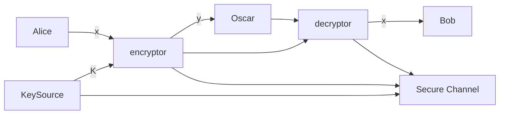
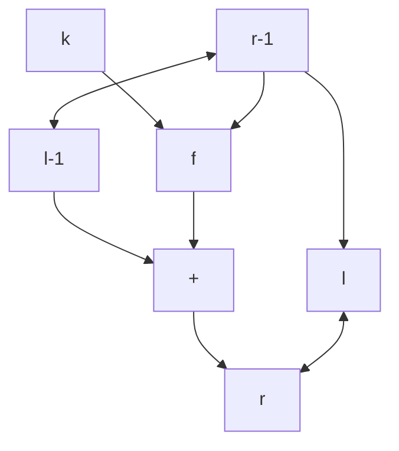
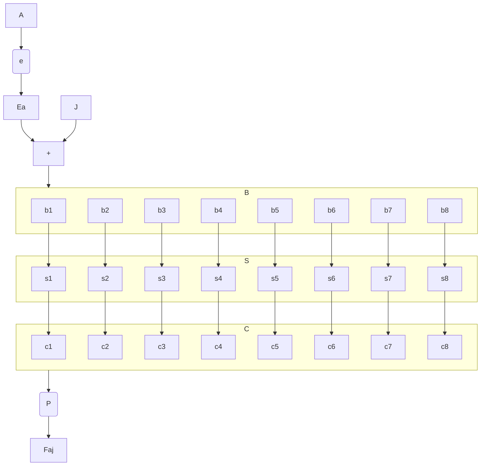
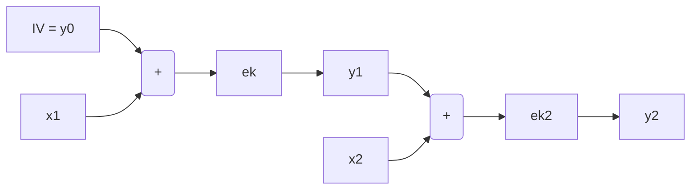
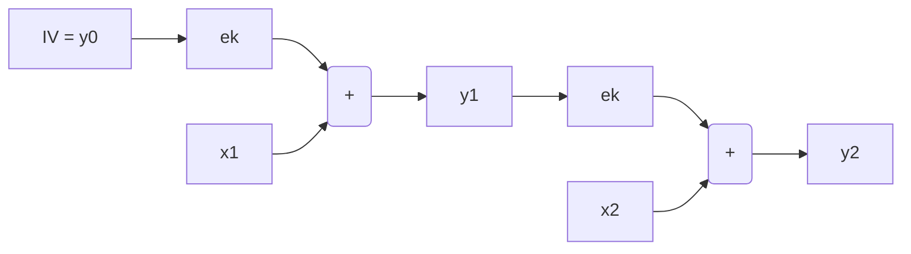
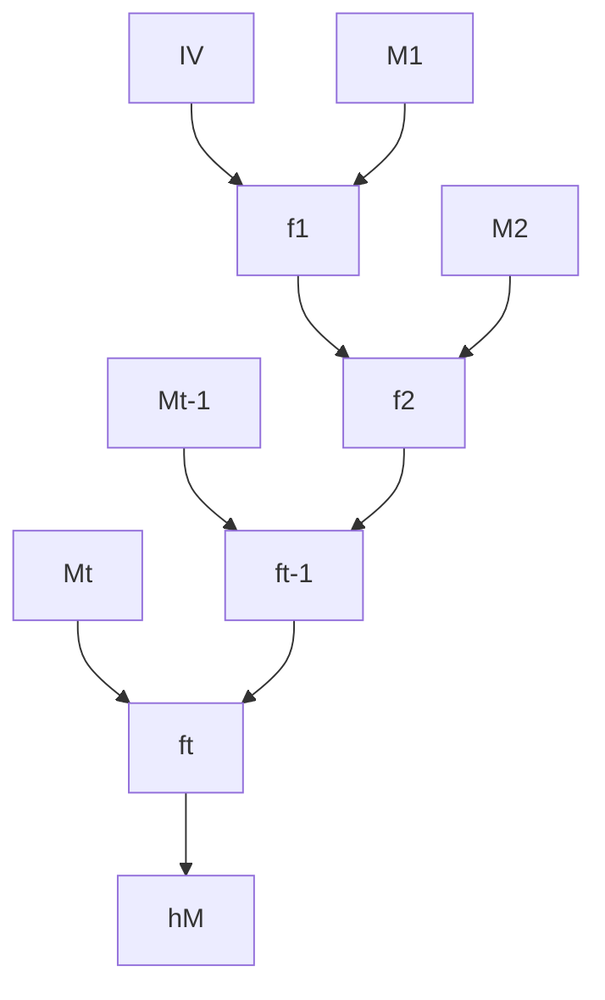
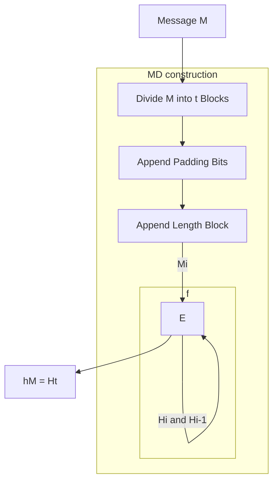
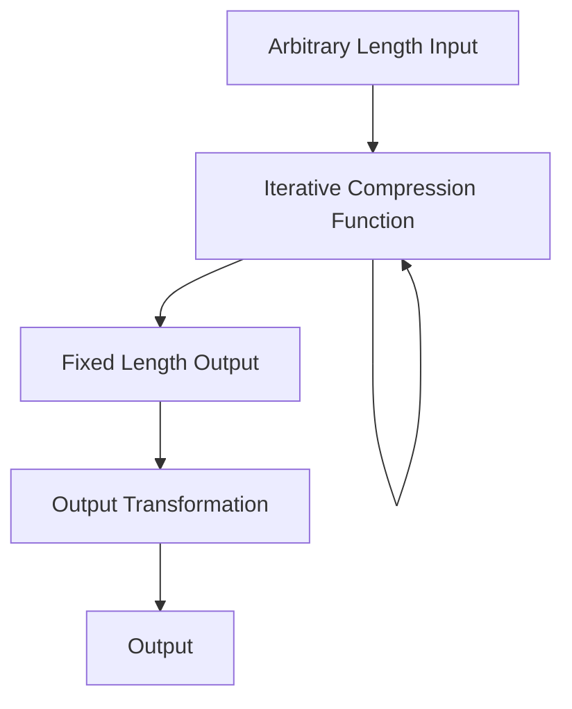
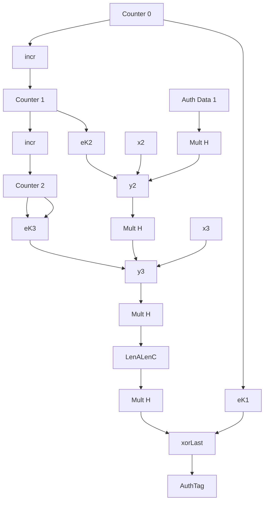

I begun reading the `Cryptography Theory and Practice` book by Stinson & Paterson
and I figured I would take notes, for those inclined to learn more about
cryptography. As a background, I am not a cryptographer. I'm an applier of
cryptography. So everything here will come from the lens of someone trying to
understand "how do I use this".

<!-- more -->

## Introduction To Cryptography

### Basic Crypto Systems

- In public private key encryption, a public key is used to encrypt the plaintext
  and the priate key is used to decrypt the text. The most widely known crypto
  system is RSA, invented by Rivest, Shamir and Adleman.
- Cryptosystems are usually categorized as block ciphers or stream ciphers.
  - Block cipher
    - Plain text is divided into fixed chunks a.k.a. **blocks**
    - Block is specified to be a bitstring of some length
    - Cipher will decrypt or encrypt one block at a time.
  - Stream Cipher
    - Constructs a key stream: a bitstring that has same length as the plaintext
    - Operation constructs the ciphertext as the exclusive-or of the plaintext
      and the keystream
    - Decryption is accomplished by computing the exclusive-or of the ciphertext
      and the keystream
  - Public-key cryptosystems are invariably block ciphers, while secret-key
    cryptosystems can be block ciphers or stream ciphers

#### Hybrid Cryptography

This method speeds up the drawbacks of slower public-key cryptosystems.

- Public key encryption for a short shared secret key
- Secret key encryption is used to encrypt longer plain text

### Message Integrity

- Secrecy == confidentiality
- Passive adversary ( can only listen in, but not alter data )
- Active adversary ( can alter, inpersonate, or divert information across a flow )
  - Mention of **bit-flipping attacks** as impacting stream ciphers
- Message Authentication Code (MAC) : secret key settings
- Public Key Settings use Signature Scheme. Roughly the same.

#### Message Authentication Codes (MAC)

- Alice uses a _secret key_ to create a _tag_ that she appends to the message
  (depends on both key and message).
- Bob uses the tag to re-compute the tag and checks to see if it is the same as
  the tag that he received.
- A variant is _encrypted-then-MAC_: Encrypt first, then tag

#### Signature Schemes

- Private key specifies a signing algo that can be used to sign messages.
- Output is called a signature
- Sign(msg, key)
- Verify(msg, signature)
- Anyone can verify signature
- It is infeasible for an adversary to create a signature
- Commonly used in software updates
- _sign-then-encrypt_ the reverse of _*encrypted-then-MAC*_

#### Nonrepudiation

- The concept not be able to take back a signature
- MAC is deniable and does not secure against repudiation.
- allows for secret conversation

#### Certificates

- Contains a websites public keys
- TA public key is typically hard coded into browser

#### Hashing

- Compresses arbirtrary length string into a fixed length `message-digest`
- After hash, signs the message digest `hash-then-sign`. Verification happens by
  comparing digest, then verification algorithm to check the validity of the
  signatures. `hash-then-sign-then-encrypt`.
- The crytographic hash is very different than a hash table:
  - hashtable: unprobable collisions
  - cryptographic: computationally infeasible to find collisions
- Cryptographic hashes can be used for key derivation
  - Hash applied to a long string to create a short random key
- Can't be used for encryption: no key and non-invertible/non-injective

### Cryptographic Protocols

- `protocol`: sequence of messages exchanged between two parties
- `session`: consists of one or many flows
- `identification scheme`: identity proof
- `key distribution scheme`: keys chosen by a trusted authority
- `key agreement` derived
- `secret sharing scheme` : involves a trusted authority distributing “pieces”
  of information (called “shares”) in such a way that certain subsets of shares
  can be suitably combined to reconstruct a certain predefined secret.
  - `threshold scheme`: (k,n)-threshold there are n shares and k permit
    reconstruction of the secret

### Security

- attack model, adversarial goal, and security level
- attack model: assumes information available to adversary
  - We will always assume that the adversary knows the scheme or protocol being
    used (this is called Kerckhoffs’ Principle).The adversary is also assumed to
    know the public key (if the system is a public-key system). On the other
    hand, the adversary is assumed not to know any secret or private keys being
    used
- adversarial goal: what does it mean for an attacker to be successful
- security level: qualify the effort to break the system
- 4 attack models:
  - `known ciphertext attack`: the adversary has access to some amount of
    ciphertext that is all encrypted with the same unknown key.
  - In a `known plaintext attack`, the adversary gains access to some plaintext as
    well as the corresponding ciphertext (all of which is encrypted with the
    same key).
  - In a `chosen plaintext attack`, the adversary is allowed to choose
    plaintext, and then they are given the corresponding ciphertext.
  - Finally, in a `chosen ciphertext attack`, the adversary chooses some
    ciphertext and they are then given the corresponding plaintext.
  - chosen models are stronger
- adverserial goal description
  - In a complete break of a cryptosystem, the adversary determines the private
    (or secret) key.
  - There are other, weaker goals that the adversary could potentially achieve,
    even if a complete break is not possible.
- Levels of security:
  - `computational security`, `provable security`, and `unconditional security`.
  - computational security: Computational security means that a specific
    algorithm to break the system is computationally infeasible, Quantum
    computing could really impact this
  - 1977 article said sipher would take 1 million years to break. It took 17 (
    better resources, improved algos, etc )
  - provable security aka _reductionist security_: breaking the cryptosystem
    (i.e., achieving the adversarial goal) can be reduced to a
    complexity-theoretic math problem.
  - unconditional security: can't be broken under any situation. One Time Pad
    problem.
- sometimes in protocols and combination flaws occurt that don't happen at the
  component level:
  - padding oracle attack (Vaudenay) uses padding as an attack vector
  - side channel attack : `timing attacks`, `fault analysis attacks`, `power analysis attacks`, and `cache attacks`

### Notes and References

- Everyday Cryptography : Fundamental Principles and Applications Keith Martin
- An Introduction to Mathematical Cryptography : Silverman et. al
- Introduction to Modern Cryptography : Katz
- Understanding Cryptography: A Textbook for Students and Practitioners : Paar
- Cryptography Made Simple : Smart
- A Classical Introduction to Cryptography: Applications for Communications
  Security : Vaudenay
- Mathematics of Public Key Cryptography : Galbraith
- Handbook of Applied Cryptography : Vanstone et. al

## Classical Cryptography

### Introduction

- Generally in cryptography, we use two actors `Alice` and `Bob`. The objective
  is that upon communication over an insecure `channel` in such a way that the
  opponent `Ocsar` cannot understand what was said.
- The cryptosystem is formally described as the following: (\$P\$, \$C\$, \$K\$, \$E\$, \$D\$)
  where the following are satisfied:
  - \$P\$ is a finite set of plaintexts
  - \$C\$ is a finite set of ciphertexts
  - \$K\$ is the key space of possible keys
  - For each \$K \in K\$, there is an encryption rule \$ e_K \in E \$ and a corresponding
    decryption ruled \$ d_K \in D \$.Each \$ e_K :P \to C\$ and \$ d_K :C \to P\$ are functions such that
    \$d_K(e_K(x)) = x \$for every plaintext element \$x \in P\$.



- Steps:
  1. Randomly choose \$ k \in K \$. Message \$x\$ is a string that Alice wants
     to share. \$ x_i \in P, 1 \le i \le n \$. Each \$ x_i \$ is encrypted using
     the rule \$\epsilon_k\$ specified by the determined \$K\$.
  2. Alice will compute \$ y_i = e_k(x_i), 1 \lt i \lt n \$ which results in
     \$y\$.
  3. Bob receives and decrypts using \$d_k = x\$. Encryption function must be an
     injective function

#### Shift Cipher

```definition
  Let $P = C = \mathbb{Z}_{26}$ for $0 \lt K \lt 25,$
  <br>
  define
  <div class="equation section">
  $e_K(x) = (x + K)$ mod 26
  </div>
  and
  <div class="equation section">
  $d_K(y) = (y − K)$ mod 26
  </div>
  <div class="section">
  $(x,y) \in \mathbb{Z}_{26}$
  </div>
```

- Basic review: modular arithmetic
  - \$ a \equiv b \$ mod m if m divides \$ b-a \$. a is `congruent` to b modulo
    m. m is the modulus. Notation: a mod m to denote the remainder when a is
    divided by m. \$ a \equiv b \$ ifff a mod m = b mod m. replace a by a mod m
    we say a is reduced modulo m. In this book _mod is always in the positive
    direction_
- \$ m \: \mathbb{Z}\_m \$ is the set \$ \\{0,...,m-1\\}\$ with two ops: \$+\$
  and \$ \times \$. Results are reduced by modulo m after standard ops.
  - ex. 11 x 13 in \$\mathbb{Z}\_{16}\ = 15$
  * addition is `closed`, i.e.,for any \$a,b \in \mathbb{Z}\_m,a+b\in \mathbb{Z}\_m\$
  * addition is `commutative`, i.e.,\$a,b \in \mathbb{Z}\_m,a+b = b+a\$
  * addition is `associative`, i.e.,\$a,b,c \in \mathbb{Z}\_m,(a+b) + c = a+(b+c)\$
  * 0 is an `additive identity`, i.e.,\$a \in \mathbb{Z}\_m,a+0= 0+a=a\$
  * the `additive inverse` of any \$a \in \mathbb{Z}\$ is \$ m-a \$ i.e \$a +
    (m-a) = (m-a)+a=0\$ for any \$a \in \mathbb{Z}\_m\$
  * multiplication is `closed`, i.e.,for any \$a,b \in \mathbb{Z}\_m,ab\in \mathbb{Z}\_m\$
  * muliplication is `commutative`, i.e.,\$a,b \in \mathbb{Z}\_m,ab = ba\$
  * muliplication is `associative`, i.e.,\$a,b,c \in \mathbb{Z}\_m,(ab)c = a(bc)\$
  * 1 is an `multiplicative identity`,i.e.,\$a \in \mathbb{Z}\_m,a \times 1= 1
    \times a=a\$
  * the `distributive property` of any \$a,b,c \in \mathbb{Z}, (a+b)c =
    (ac)+(bc)\$ and \$a(b+c) = (ab) + (ac)\$
- The closed, associative, additive identity, additive inverse create a **group**
- If also commutative, it is called an **abelian group**
- All properties establish a \$\mathbb{Z_m}\$ is a **ring**
- Shift cipher (encryption):
  1. Convert each character A-Z to 0-16
  2. Add it by K and take the mod 26
  3. Convert to characters
- Decryption
  1. Convert each character A-Z to 0-16
  2. Subtract it by K and take the mod 26
  3. Convert to characters
- Note: habit of doing cypertext as uppercase and plaintext as lowercase
- This is a weak crypto method, b/c `exhaustive key search` only requires 26 keys

#### Substitution Cipher

```definition
<div class="section">Let $P = C = \mathbb{Z}_{26}$.</div>
<div class="section">
$K$ consists of all possible permutations of the 26 symbols
0,1,...,25. For each permutation $\pi \in K$, define
</div>
<div class="section equation">
  $\epsilon_{\pi}(x) = \pi(x)$
</div>
<div class="section equation">
  $ d_{\pi}(y) = \pi^{-1}(y)$
</div>
where π−1 is the inverse permutation to $\pi$.
```

- Basically, choose some random substitutions and then use the mapping to
  compute the inverse. 26! That's \$4x10^{26}\$ combinations. Infeasible to
  compute through exhaustive search, but there's other ways to break this.

#### Affine Cipher

```definition
Let $P = C = \mathbb{Z}_{26}$ and let
<div class="section equation">
$K = {(a,b) \in \mathbb{Z}_{26} ×\mathbb{Z}_{26} : gcd(a,26) = 1}$
</div>
For $K = (a, b) \in K$, define
<div class="section equation">
  $e_K(x) = (ax + b)$ mod 26
</div>
and
<div class="section equation">
  $d_K(y) = a^{-1}(y-b)$ mod 26
</div>
$(x, y \in \mathbb{Z}_{26})$.
```

- restrict sub cipher to : $e(x) = (ax + b)$ mod 26
- requirement: injective
- \$gcd(4,26) = 2\$ therefore 2 solutions (x and x+13) will work. Non-injective.

```theorem
The congruence $ax \equiv b$ (mod m) has a unique solution $x \in \mathbb{Z}_m$ for every $b \in \mathbb{Z}_m$ if and only if $gcd(a,m) = 1$.
```

- \$ax \equiv y \$ (mod 26) has only one solution if \$gcd(a,26)=1\$

```definition
Suppose $a \geq 1$ and $m \geq 2$ are integers. If $gcd(a, m) = 1$, then we say that a and m
are relatively prime. The number of integers in $\mathbb{Z}_m$ that are relatively prime to
m is often denoted by $\phi(m)$ -- Euler phi function.
```

- takaway: primes are used to ensure injectivity
- You can do the same with multipliers.
  - ex. \$60 = 22 \times 31 \times 51\$ to \$\phi(60) = (4−2)\times(3−1)\times(5−1) = 2\times2\times4 = 16\$

```definition
Suppose $a \in \mathbb{Z}_m$. The multiplicative inverse of a modulo m, denoted $a^1$ mod m, is an element $a' \in \mathbb{Z}_m$ such that $aa' \equiv a'a \equiv 1$ (mod m). If m is fixed, it can be written as $a^1$ for $a^1$ mod m.
```

- [ ] A ring where if p is prime, then every non-zero element of \$\mathbb{Z}\_p\$
      has a multiplicative inverse. This is called a `field`.
  - \$7x15=105 \equiv 1 \$ (mod 26) so \$7^{-1} = 15\$ and \$ 15^{-1} = 7\$

#### Vigenere Cipher

```definition
Let $m$ be a positive integer. Define $P = C = K = \mathbb{Z}_{26}^{m}.$
<p>For key $K = (k_1, k_2, ..., k_m)$ we defined:
<div class="equation section">
  $e_K(x_1,x_2,...,x_m) = (x_1 +k_1,x_2 +k_2,...,x_m +k_m)$
</div>
and
<div class="equation section">
  $d_K(y_1,y_2,...,y_m) = (y_1 - k_1, y_2 - k_2,...,y_m - k_m )$
</div>
Where all operations are performed on $\mathbb{Z}_{26}$
</p>
```

- shift and cipher are `monoalphabetic cryptosystems`, 1:1 key mapping
- K with alphabet string of len \$m\$ called a _keyword_. It encrypts a block at
  a time.
- Add the keyword to plaintext in blocks
- \$26^{m}\$ combinations
- `polyalphabetic cryptosystem`: one character to many. Generally harder to solve.

#### Hill Cipher

```definition
Let $m \geq 2$ be an integer. Let $P = C = \mathbb{Z}_{26}^{m}$ and let

<div class="equation">
  $K = \{m × m$ invertible matrices over $\mathbb{Z}_{26}\}$
</div>

For a key $K$ we derive:

<div class="equation">
  $e_K(x) = xK$
</div>

and

<div class="equation">
  $d_K(y) = yK^{-1}$
</div>

where all operations are performed in $\mathbb{Z}_{26}$.
```

- Idea: take \$m\$ linear combinations of the \$m\$ alphabetic characters in the
  plaintext, which produces \$m\$ alphabetic characters in one ciphertext element.
- \$y = xK\$
- linear tranformation and decryption is just the inverse \$x = yK^{-1}\$
- matrix product. Standard linear algebra stuff but with modular math.
  \$c\_{i,k} = \sum{a\_{i,j} ,b\_{i,j}} \$
- july = K(3,4),K(11,22) where K is a 2x2 matrix
- decryption: use the inverse.

```definition
Determinant is a scalar value that is a function of the entries of a square matrix. It characterizes some properties of the matrix and the linear map represented by the matrix
<div class="equation">
$det A = \sum(-1)^{i+j}a_{i,j}detA_{i,j}$
</div>
```

- The inverse will exist if determininant is non-zero.
- K\* the `adjoint matrix` of K

```theorem
Suppose $K = (k_{i,j})$ is an $m × m$ matrix over $\mathbb{Z}_{26}$ such that det K is
invertible in $\mathbb{Z}_{26}$. Then $K^{−1} = (det K)^{−1}K^{*}$, where $K^{*}$ is the adjoint matrix of K
```

```todo
Review this
```

#### Permutations Cipher

```definition

Let $m$ be a positive integer. Let $P = C = \mathbb{Z}_{26}^m$ and let $K$ consist of all permutations of $\{1,...,m\}$. For a key $\pi$, we define:

<div class="equation">
  $e_{\pi}(x_1,...,x_n) = (x_{\pi}^1,...,x_{\pi}^n)$
</div>

<div class="equation">
  $d_{\pi}(y_1,...,y_n) = (y_{\pi}^1,...,y_{\pi}^n)$
</div>

where $\pi^-1$ is the inverse permutation of $\pi$
```

- Plain text unchanged, just ordering changed.
- \$\pi \: X \to X\$ injective and surjective function so \$\pi^{-1} \: X \to X\$
- A special case of the hills cipher. Just change the ordering into a matrix.

#### Stream Cipher

- Given a key stream \$z = z_1 z_2... \to x = x_1 x_2...\$
- Synchronous stream cipher the simpliest.

```definition
A synchronous stream cipher is a tuple $(P, C, K, L, E, D)$, together with a function g, such that the following conditions are satisfied:

<ol>
<li> $P$ is a finite set of possible plain texts</li>
<li> $C$ is a finite set of cyphertexts</li>
<li> $K$, the keyspace, is a finite set of possible keys</li>
<li> $L$ is a finite set called the keystream alphabet</li>
<li> $g$ is the keystream generator. $g$ takes a key $K$ as input, and generates an infinite string z1z2 ... called the keystream, where $z_i \in L$ for all $i ≥ 1$.</li>
<li> For each $z \in L$, there is an encryption rule $e_z \in E$ and a corresponding decryption rule $d_z \in D$. $e_z \:P \to C$ and $d_z \:C \to P$ are functions such that $d_z(e_z(x)) = x$ for every plaintext element $x \in P$.</li>
</ol>
```

- `periodic stream cipher` with period d if $z_{i+d} = z_i$ for all integers $i
  \geq 1$. For example, Vigenere Cipher, the period is m, the length of the
  keyword, the period is m, the length of the keyword, the period is m, the
  length of the keyword, the period is m, the length of the keyword.
- Often stream ciphers are described in terms of binary alphabets. Exlusive is
  modulus or. \$e_z(x) = (x + z) mod 2\$ and \$d_z(y) = (y + z) mod 2\$
- generate keystream using linear recurrence of degree m.
- linear feedback shift register (LFSR)

**Sample Script**

```python
# Example 2.8
# an implementation a linear recurrence example
x = bin(8)
m,l= 4,2
for i in range(20):
    x_v = x[-m:]
    x += str(x_v[:2].count( "1" ) % 2)
return x
# result
#: 0b100010011010111100010011
```

#### Autokey Cipher

- `non-synchronous stream cipher` each stream cipher in which each keystream
  element zi depends on previous plaintext or ciphertext element as well as the
  key.

```definition
Let $P=C=K=L\mathbb{Z}_{26}$ Let $z_1 =K$ and define $z_i = x_{i−1}$ and $\forall{i \geq 2}$.
For $0 \leq z \leq 25$ define

<div class="equation">
</div>

<div class="equation">
  $e_z(x) = (x + z)$ mod 26
</div>

<div class="equation">
  $d_z(y) = (y - z)$ mod 26
</div>


$(x, y \in \mathbb{Z}_{26})$.
```

**Sample script**

```python
# Example 2.9
# Autocipher Key example
mod = 26

class AutoKeyCipher():

    def __init__(self, K):
        self._K = K
        self.enc_k = K
        self.dec_k = K

    def encrypt(self, x):
        y = (self.enc_k+x)%mod
        self.enc_k = x
        return y

    def decrypt(self, x):
        z = (x-self.dec_k) % mod
        self.dec_k = z
        return z


plaintext = [17,4,13,3,4,25,21,14,20,18]
cipher = AutoKeyCipher(K=8)
enc = [cipher.encrypt(x) for x in plaintext]
dec = [cipher.decrypt(x) for x in enc]
return enc, dec

# result:
# | 25 | 21 | 17 | 16 | 7 |  3 | 20 |  9 |  8 | 12 |
# | 17 |  4 | 13 |  3 | 4 | 25 | 21 | 14 | 20 | 18 |
```

### Cryptanalysis

Oscar knows the crypto system being used as `Kerckhoffs’ Principle`.

- 4 attack models:
  - `known ciphertext attack`: the adversary has access to some amount of
    ciphertext that is all encrypted with the same unknown key. Weakest type of attack.
  - In a `known plaintext attack`, the adversary gains access to some plaintext as
    well as the corresponding ciphertext (all of which is encrypted with the
    same key).
  - In a `chosen plaintext attack`, the adversary is allowed to choose
    plaintext, and then they are given the corresponding ciphertext.
  - Finally, in a `chosen ciphertext attack`, the adversary chooses some
    ciphertext and they are then given the corresponding plaintext.
  - chosen models are stronger
- adverserial goal description
  - In a complete break of a cryptosystem, the adversary determines the private
    (or secret) key.
  - There are other, weaker goals that the adversary could potentially achieve,
    even if a complete break is not possible.


| Letter | probability | Letter | probability |
| ------ | ----------- | ------ | ----------- |
| a | .082 | N | .067 |
| b | .015 | O | .075 |
| c | .028 | p | .019 |
| d | .043 | q | .001 |
| e | .127 | r | .06 |
| .. | .. | .. | .. |
| m | .024 | z | 0.01 |


#### Affine Cipher

Cyphertext probabilities


| Letter | freq | Letter | freq |
| ------ | ---- | ------ | ---- |
| a | 2 | N | 1 |
| b | 1 | O | 1 |
| c | 0 | p | 2 |
| d | 7 | q | 0 |
| e | 5 | r | 8 |
| .. | | .. | |
| m | 2 | z | 0 |


- System of equations and allowable gcd to solve

#### Substitution Cipher

- statistical basis and pattern recognition for looking at consecutive characters

#### Vigenere Cipher

- Find the keyword length m.
- Kasiski test: two identical segments of plaintext will be encrypted to the
  same ciphertext whenever their occurrence in the plaintext is \$\delta\$
  positions apart, where \$\delta \equiv 0\$(mod m)
  - incidence of coincidence
- find pattern, look at length, then that gives keylength

```todo
more review
```

#### Hill Cipher

- hard at cipher-text attack
- fails at plain text attacks
  - given both, you can just compute the inverse

#### LFSR Stream Cipher

- compute the keystream bits from the plaintext + ciphertext
- needs to know the stage
- convert to a matrix, and solve

### Notes and References

- Decrypted Secrets: Methods and Maxims of Cryptology: by Friedrich Bauer
- Code Breaking A History and Exploration: by Rudolf Kippenhahn
- Basic Methods of Cryptography: Jan van der Lubbe
- Elementary Number Theory, 7th Edition David Burton
- Linear Algebra and Its Applications, 5th Edition: David Lay, Steven Lay, and Judi McDonald
- The Codebreakers: The Comprehensive History of Secret Communication from Ancient Times to the Internet by David Kahn
- The Code Book: The Science of Secrecy from Ancient Egypt to Quantum Cryptography: Simon Singh

### Exercises

```todo
To do later
```

## Shannon’s Theory, Perfect Secrecy, and the One-Time Pad

### Introduction

- **computational security:** We might define a cryptosystem to be
  computationally secure if the best algorithm for breaking it requires at least
  $N$ operations, where N is some specified, very large number.
- **provable security:** If the cryptosystem can be “broken” in some specific
  way, then it would be possible to efficiently solve some well- studied problem
  that is thought to be difficult
- **unconditional security:** A cryptosystem is defined to be unconditionally secure if
  it cannot be broken, even with infinite computational resources.

### Elementary Probability Theory

```definition
A discrete random variable, say $X$, consists of a finite set $X$ and a probability distribution defined on $X$. The probability that the random variable $X$ takes on the value x is denoted $\textbf{Pr}[\textbf{X} = x]$; sometimes we will abbreviate this to $\textbf{Pr}[x]$ if the random variable $X$ is fixed. It must be the case that $0 \leq \textbf{Pr}[x] : \forall x \in X$, and
<div class="equation">
$\sum_{x \in X}\textbf{Pr}[x] = 1$
</div>
```

- Joint Probability: \$ P\[x,y\] = P\[x|y\]P[y\] = P\[y|x\]Pr\[x\] \$
- Bayes theorem: \$ P\[y\] > 0\$ then \$P\[x|y\] = \frac{P\[x\]P\[y|x\]}{P\[y\]} \$

### Perfect Secrecy

- \$P\$ = probability distribution on the plaintext space. Thus the plaintext element defines a random variable, denoted x.
- We denote the a priori probability that plaintext x occurs by Pr[x = x]
- We also assume that the key K is chosen (by Alice and Bob) using some fixed
  probability distribution ( normally at random ).
- Denote the probability that key K is chosen by Pr[K = K].
- induce probably distribution \$C\$. Cipher text can considered a random
  varaible y.
- To compute the proabiliy Pr[y=y]a ( y is the cipher text transmitted ). For a
  key \$k \in K\$ defined:
  
  C(K) = {eK(x) : x ∈ P}
  
- \${C(K)}\$ represents a set of cipher texts if K is key
- then:
  Pr[y = y] = \sum{Pr[K = K]Pr[x = d_K(y)]}.
  
- compute the conditional probabiity:
  
  Pr[y = y|x = x] = \sum{Pr[K = K]}
  
- then compute the conditional probability that given x is the plaintext given y
  is the cyphertext:
  
  Pr[x = y|y = x] = \frac{P[x=x] \times \sum{P[K=k]}}{\sum{P[K=k]P[x=d_k(y)]}}
  

```definition
A cryptosystem has perfect secrecy if $Pr[x|y] = Pr[x]$ for all $x \in P, y \in C$.
That is, the a posteriori probability that the plaintext is x, given that the
ciphertext $y$ is observed, is identical to the a priori probability that the plaintext is $x$.
```

- Shift Cipher is “unbreakable” provided that a new random key is used to
  encrypt every plaintext character.

```todo
revisit
```

### One Time Pad

```definition
Let $n \geq 1$ be an integer, and take $P = C = K = \mathbb{Z}_2^n$. For $K \in (\mathbb{Z}_{2})^n$,
define $e_K(x)$ to be the vector sum modulo 2 of K and x (or, equivalently,
the exclusive or of the two associated bitstrings).
So, if $x = (x_1, . . . , x_n)$ and $K = (K_1, . . . ,K_n)$, then

<div class="equation">
$e_K(x) = (x_1 + K_1, . . . , x_n + K_n)$ mod 2
</div>
Decryption is identical to encryption. If $y = (y_1, . . . , y_n)$, then

<div class="equation">
  $dK(y) = (y_1 + K_1, . . . , y_n + K_n)$ mod 2
</div>
```

- 1917 algo that automatic encryption and decryption of telegraph messages
- thought unbreakable until Shannon created perfect secrecy
- In cryptography, the one-time pad (OTP) is an encryption technique that cannot
  be cracked, but requires the use of a single-use pre-shared key that is not
  smaller than the message being sent. In this technique, a plaintext is paired
  with a random secret key (also referred to as a one-time pad). Then, each bit
  or character of the plaintext is encrypted by combining it with the
  corresponding bit or character from the pad using modular addition.
- downside \$|K| \geq |P|\$ requires the amount of key must be at least as big
  as the plaintext.
  - n bits for n plaintext
  - only used one time
- One-time Pad is vulnerable to a known-plaintext attack, since K can be
  computed as the exclusive-or of the bitstrings x and eK(x)
- in some cases, such as military or diplomatic security, OTP might be used.
- The key must be at least as long as the plaintext.
- The key must be random (uniformly distributed in the set of all possible keys
  and independent of the plaintext), entirely sampled from a non-algorithmic,
  chaotic source such as a hardware random number generator. It is not
  sufficient for OTP keys to pass statistical randomness tests as such tests
  cannot measure entropy, and the number of bits of entropy must be at least
  equal to the number of bits in the plaintext. For example, using cryptographic
  hashes or mathematical functions (such as logarithm or square root) to
  generate keys from fewer bits of entropy would break the uniform distribution
  requirement, and therefore would not provide perfect secrecy.
- The key must never be reused in whole or in part.
- The key must be kept completely secret by the communicating parties.
- \${\textstyle \mathrm {H} (M)=\mathrm {H} (M|C)}{\textstyle \mathrm {H}
  (M)=\mathrm {H} (M|C)}\$, where \${\textstyle \mathrm {H} (M)}{\textstyle
  \mathrm {H} (M)}\$

### Entropy

- Shannon introduce entropy in 1948
- This quantity is called the entropy of X and is denoted by H(X).

```definition
Suppose X is a discrete random variable that takes on values from a finite set
X. Then, the entropy of the random variable X is defined to be the quantity

<div class="equation">
$H(X)= − \sum{Pr[x] log_2 Pr[x]}$.
</div>
```

#### Properties of Entropy

```definition
A real-valued function $f$ is a <b>concave function</b> on an interval $I$ if
<div class="equation">
$f \left(\frac{x+y}{2}\right) \geq \frac{f(x)+f(y)}{2}$
</div>
for all $x,y \in I $ $f$. $f$ is a <b>strictly concave function</b> on an interval $I$
<div class="equation">
$f \left(\frac{x+y}{2}\right) \gt \frac{f(x)+f(y)}{2}$
</div>
for all $x, y \in I, x  \ne y$.
```


\textbf{Jensen's Inequality:} \\
\sum{a_if(x_i) \leq f\left(\sum(a_ix_i)\right)}


```definition
Suppose X and Y are two random variables.
Then for any fixed value y of Y, we get a (conditional) probability distribution on X;
we denote the associated random variable by X|y.
<div class="equation">
  $H(X|y) = - \sum{Pr[x|y] log2 Pr[x|y]}$
</div>
We define the conditional entropy, denoted H(X|Y),
to be the weighted average (with respect to the probabilities Pr[y])
of the entropies H(X|y) over all possible values y. It is computed to be
<div class="equation">
  $H(X|Y) = − \sum_y \sum_x Pr[y]Pr[x|y] log2 Pr[x|y]$
</div>
The conditional entropy measures the average amount of information about X that is not revealed by Y.

```

### Spurious Keys and Unicity Distance

- The conditional entropy H(K|C) is called the key equivocation; it is a measure
  of the amount of uncertainty of the key remaining when the ciphertext is
  known.
- In a cryptosystem
  
  H(K|C) = H(K) + H(P) − H(C)
  
  
  H(K, P, C) = H(K, P) = H(K) + H(P).
  
  
  H(K|C) = H(K) + H(P) − H(C)
  
- The remaining possible, but incorrect, keys are called spurious keys
- Pn to be the random variable that has as its probability distribution that of
  all n-grams of plaintext.

```definition
Suppose $L$ is a natural language. The entropy of $L$ is defined
to be the quantity
<div class="equation">
$H_L = \lim_{n \to \inf}\frac{H(P^n)}{n}$
</div>
 and the redundancy of L is defined to be
 <div class="equation">
 $R_L = 1 - \frac{H_L}{\log_2|P|}$
 </div>
```

- Estimate of HL gives a redundancy of about 0.75. This means that the English language is 75% redundant!

- spurious key computation:
  
  K(y)={K \in K:\exists x\in P^{n} \text{ such that } Pr[x]>0 \text{ and } e_K(x)=y}.
  

- That is, K(y) is the set of keys K for which y is the encryption of a
  meaningful string of plaintext of length n, i.e., the set of “possible” keys,
  given that y is the ciphertext. Average number of spurious keys are
  \$\sum{Pr[y]|K(y)|}− 1.\$

```theorem
Suppose $(P, C, K, E, D)$ is a cryptosystem where $|C| = |P|$ and keys are
chosen equiprobably. Let RL denote the redundancy of the underlying language.
Then given a string of ciphertext of length n, where n is sufficiently large,
the expected number of spurious keys, sn, satisfies
$s_n \geq \frac{|K|}{P^{nR_L}} - 1$
```

**unicity distance**

```definition
The unicity distance of a cryptosystem is defined to be the value of n, denoted by $n_0$,
at which the expected number of spurious keys becomes zero;
i.e., the average amount of ciphertext required for an opponent to be
able to uniquely compute the key, given enough computing time.
```


n_0 \approx \frac{log_2{|K}}{R_L log_2|P|}


- For substitution: In this cryptosystem, |P| = 26 and |K| = 26!. If we take RL = 0.75, then we get an estimate for the unicity


n_0 \approx \frac{88.4}{.74 x 4.7} \approx 25


- Suggests with 25, usually decryption is possible

### Notes and References

- Codes and Cryptography by Dominic Welsh
- Communication Theory by Charles Goldie and Richard Pinch

### Exercises

```todo
To do later
```

## Block Ciphers and Stream Ciphers

### Introduction

- most block ciphers incorporate a sequence of permutation and substitution operations
- _iterated cipher_, _round function_, _key schedule_. encryption of a plaintext will proceed through N similar rounds.
- Let \$K\$ be a random binary key of some specified length. Use K to construct
  $N$ round keys ( subkeys ), denoted by \$K^1,...,K^N\$. The list of round keys
  \$(K^1,...,K^N)\$ is the key schedule. The key schedule is constructed from K
  using a public algorithm.
  \$g(K^\gamma, w^{gamma-1})\$ is the round function. The next state is \$ wr =
  g(w^{\gamma−1}, K^{\gamma}) \$. Initial state is \$w^0=x\$. Ciphertext y is
  defined as the state after N rounds are performed.


w^0 \leftarrow x



w^1 \leftarrow g(w^0,K^1)



w^2 \leftarrow g(w^1,K^2)



y \leftarrow g(w^N)


- g must be injective for encryption
- \$g^{-1}(g(w, y), y) = w\$
- Do the above, in reverse

#### Substitution-Permutation Networks

- A substitution-permutation network(SPN).
- special type of iterative cipher
- P and C are binary vectors of length lm (block length of the cipher)
- SPN built using:
- permute box: \$ \pi\_{P} : | 1,...,lm| \to |1,...,lm| \$
- substitute box: \$ \pi_S : | {0,1}^l | \to | {0,1}^l| \$
- x-ors with subkeys
- whitening, a useful way to prevent an attacker from even beginning to carry
  out an encryption or decryption operation if the key is not known.
- lm = block length

```python
def chunk(n, w, s):
    '''chunks bins into windows'''
    n = hex(n)[2:]
    return [bin(int(f, base=16))[2:].zfill(4) for f in n]

def make_round_keys(n,w,s):
    '''makes round keys from seed'''
    splits = chunk(k, w, s)
    keys = []
    for i in range(5):
        keys.append(splits[i:i+4])
    return keys

# subtitute keys
piS = {
    0x0: 0xe,
    0x1: 0x4,
    0x2: 0xD,
    0x3: 0x1,
    0x4: 0x2,
    0x5: 0xF,
    0x6: 0xB,
    0x7: 0x8,
    0x8: 0x3,
    0x9: 0xA,
    0xa: 0x6,
    0xb: 0xC,
    0xc: 0x5,
    0xd: 0x9,
    0xe: 0x0,
    0xf: 0x7
}

# permute keys
piP = [1,5,9,13,2,6,10,14,3,7,11,15,4,8,12,16]

def fpP(i):
    '''permutation function'''
    return piP[i]

def fpS(v):
    '''substitution function'''
    return piS[v]

def spn(keys, pP, pS, plaintext):
    '''
    TODO: refactor this. works though
    keys: round keys
    pP: permutation function
    pS: substitution function
    plaintext: input
    '''
    w = chunk(plaintext, 4, 4) # chunk the plaintext into 4 bits each

    for i in range(len(keys)-1):
        k,u,v= keys[i],[],[]
        [ u.append(int(w[i], 2) ^ int(k[i], 2)) for i in range(len(w)) ] # xor
        against keys
        v = ''
        for u1 in u:
            v += '{}'.format(bin(pS(int(u1)))[2:].zfill(4)) # substitute
        w1 = ''
        for i in range(len(v)):
            w1 += str(v[pP(i)-1])  # permute against keys
        w2 = int(w1,2)
        if i == 3: # final step, you break
            break
        w = chunk(w2, 4, 4) # chunk
    k = keys[4]
    y = bin(int(''.join(k),2) ^ int(v, 2)) #whitening step
    return y[2:]

k = 0x3a94d63f
w = 4
s = 4

rk = make_round_keys(k,w,s)
return spn(rk, fpP, fpS, 0x26B7)

# under assumption l == m == N == 4
#result : 1011110011010110
```

### Cryptanalysis

#### Linear Approximation of S Boxes

- might be possible to find a probabilistic linear relationship between subset
  of plaintexts bits and subset state bits proceeding substitution last round
- piling up lemma : bias of random varibles
- \$[PR\[X = 1\]=\frac{1}{2} - \epsilon_j]\$ and \$[PR\[X = 1\]=\frac{1}{2} + \epsilon_j]\$
- find linear approximation on an spn

#### Linear Attack on SPN

- derive a linear approximation of S boxes
- active S box approx
- check if approx is satisfied
- update freq table for all candidate keys
- correct canditate key will have largest tally
- if cipher is random, appox won't work
  - lc is a distiguisher. determine if it's not random
- bais = 2e1e2 for x1 ^ x2
- check bias for xors with input and output i.e x1 ^ x4 ^ y1
- \$(\oplus a_iX_i) \oplus (\oplus b_iY_i)\$
- 16x16 table
- check the # of times it matches

**Example Linear Appox Table**

| 0 | 1 | 2 | ... | 16 |
|----|----|---|-----|----|
| 0 | 16 | 8 | | 8 |
| 1 | 8 | 6 | | 8 |
| 2 | 8 | 6 | | 10 |
| 16 | 8 | 8 | | 8 |


- bias = T[a/,b]/16 - 1/2

```python
# copied from https://github.com/hkscy/Basic-SPN-cryptanalysis/blob/master/linear_cryptanalysis.py
# Linear cryptanalysis of the basic SPN cipher based on 'A Tutorial on Linear
# and Differential Cryptanalysis' by Howard M. Heys.
#
# We try to determine linear expressions between the input and output bits
# which have a linear probability bias. Randomly chosen bits would only
# satisfy the expression with probability 0.5 (Matsui's Piling up Lemma)
#
# 02/12/16 Chris Hicks

import basic_SPN as cipher
from math import trunc, fabs
import itertools as it
import collections

# Return bit n from (nibble) bits of bit-length 4
def getNibbleBit(bits, n):
    return int(bin(bits)[2:].zfill(4)[n])

# Return bit n from (short) bits of bit-length 16
def getShortBit(bits, n):
    return int(bin(bits)[2:].zfill(16)[n])

# Build table of input values
sbox_in = ["".join(seq) for seq in it.product("01", repeat=4)]
# Build a table of output values
sbox_out = [ bin(cipher.sbox[int(seq,2)])[2:].zfill(4) for seq in sbox_in ]
# Build an ordered dictionary between input and output values
sbox_b = collections.OrderedDict(zip(sbox_in,sbox_out))
# Initialise the Linear Approximation Table (LAT)
probBias = [[0 for x in range(len(sbox_b))] for y in range(len(sbox_b))]

# A complete enumeration of all the linear approximations of the simple SPN
# cipher S-Box. Dividing an element value by 16 gives the probability bias
# for the particular linear combination of input and output bits.
print('Linear Approximation Table for basic SPN cipher\'s sbox: ')
print('(x-axis: output equation - 8, y-axis: input equation - 8)')
for bits in sbox_b.items():
    input_bits, output_bits = bits
    X1,X2,X3,X4 = [ int(bits,2) for bits in [input_bits[0],input_bits[1],input_bits[2],input_bits[3]] ]
    Y1,Y2,Y3,Y4 = [ int(bits,2) for bits in [output_bits[0],output_bits[1],output_bits[2],output_bits[3]] ]

    equations_in = [0, X4, X3, X3^X4, X2, X2^X4, X2^X3, X2^X3^X4, X1, X1^X4,
                    X1^X3, X1^X3^X4, X1^X2, X1^X2^X4, X1^X2^X3, X1^X2^X3^X4]

    equations_out = [0, Y4, Y3, Y3^Y4, Y2, Y2^Y4, Y2^Y3, Y2^Y3^Y4, Y1, Y1^Y4,
                    Y1^Y3, Y1^Y3^Y4, Y1^Y2, Y1^Y2^Y4, Y1^Y2^Y3, Y1^Y2^Y3^Y4]

    for x_idx in range (0, len(equations_in)):
        for y_idx in range (0, len(equations_out)):
            probBias[x_idx][y_idx] += (equations_in[x_idx]==equations_out[y_idx])

# Print the linear approximation table
for bias in probBias:
    for bia in bias:
        #trunc(((bia/16.0)-0.5)*16.0)
        print('{:d}'.format(bia-8).zfill(2), end=' ')
    print('')

# Constructing Linear Approximations for the Complete Cipher.
# It is possible to attack the cipher by recovering a subset of the subkey
# bits that follow the last round.

# Using the LAT, we can construct the following equation that holds with
# probability 0.75. Let U_{i} and V_{i} represent the 16-bit block of bits
# at the input and output of the round i S-Boxes, respectively, and let
# K_{i,j} represent the j\'th bit of the subkey block of bits exclusive-ORed
# at the input to round i. Also let P_{i} represent the i\'th input bit, then
#
# U_{4,6}⊕U_{4,8}⊕U_{4,14}⊕U_{4,16}⊕P_{5}⊕P_{7}⊕P_{8}⊕SUM(K) = 0 where
#
# SUM(K) = K_{1,5}⊕K_{1,7}⊕K_{1,8}⊕K_{2,6}⊕K_{3,6}⊕K_{3,14}⊕K_{4,6}⊕K_{4,8}⊕K_{4,14}⊕K_{4,16}
#
# holds with a probability of 15/32 (with a bias of 1/32).
#
# Since sum(K) is fixed (by the key, k), U_{4,6}⊕U_{4,8}⊕U_{4,14}⊕U_{4,16}⊕P_{5}⊕P_{7}⊕P_{8} = 0
# must hold with a probability of either 15/32 or 1-15/32. In other words we
# now have a linear approximation of the first three rounds of the cipher with
# a bias of magnitude 1/32.

k = cipher.keyGeneration()
k_5 = int(k,16)&0xffff #Just last 16 bits are K5
k_5_5_8 = (k_5>>8)&0b1111
k_5_13_16 = k_5&0b1111

print('\nTest key k = {:}'.format(k), end = ' ')
print( '(k_5 = {:}).'.format(hex(k_5).zfill(4)))
print('Target partial subkey K_5,5...k_5,8 = 0b{:} = 0x{:}'.format(bin(k_5_5_8)[2:].zfill(4), hex(k_5_5_8)[2:].zfill(1) ))
print('Target partial subkey K_5,13...k_5,16 = 0b{:} = 0x{:}'.format(bin(k_5_13_16)[2:].zfill(4), hex(k_5_13_16)[2:].zfill(1) ))
print('Testing each target subley value...')

countTargetBias = [0]*256

for pt in range(10000):
    ct = cipher.encrypt(pt, k)
    ct_5_8 = (ct>>8)&0b1111
    ct_13_16 = ct&0b1111

    # For each target partial subkey value k_5|k_8|k_13|k_16 in [0,255],
    # increment the count whenever equation (5) holds true,

    for target in range(256):
        target_5_8 = (target>>4)&0b1111
        target_13_16 = target&0b1111
        v_5_8 = (ct_5_8^target_5_8)
        v_13_16 = (ct_13_16^target_13_16)

        #for target_13_16 in range(16):
        # Does U_{4,6}⊕U_{4,8}⊕U_{4,14}⊕U_{4,16}⊕P_{5}⊕P_{7}⊕P_{8}⊕SUM(K) = 0?

	    # (1) Compute U_{4,6}⊕U_{4,8}⊕U_{4,14}⊕U_{4,16} by running the ciphertext
	    # backwards through the target partial subkey and S-Boxes.
	    # xor ciphertext with subKey bits

	    # (2) Run backwards through s-boxes
        u_5_8, u_13_16 = cipher.sbox_inv[v_5_8], cipher.sbox_inv[v_13_16]

        #print(((pt>>11)&0b1)^((pt>>9)&0b1)^((pt>>8)&0b1))
	    # (3) Compute linear approximation U_{4,6}⊕U_{4,8}⊕U_{4,14}⊕U_{4,16}⊕P_{5}⊕P_{7}⊕P_{8}
        lApprox = ((u_5_8>>2)&0b1)^(u_5_8&0b1)^((u_13_16>>2)&0b1)^(u_13_16&0b1)^((pt>>11)&0b1)^((pt>>9)&0b1)^((pt>>8)&0b1)
        if lApprox == 0:
            countTargetBias[target] += 1

# The count which deviates the largest from half of the number of
# plaintext/ciphertext samples is assumed to be the correct value.
bias = [fabs(lAprx - 5000.0)/10000.0 for lAprx in countTargetBias]

maxResult, maxIdx = 0,0
for rIdx, result in enumerate(bias):
    if result > maxResult:
        maxResult = result
        maxIdx = rIdx

print('Highest bias is {:} for subKey value {:}.'.format(maxResult, hex(maxIdx)))
if (maxIdx>>4)&0b1111 == k_5_5_8 and maxIdx&0b1111 == k_5_13_16:
	print('Success!')
else:
	print('Failure')

```

**Result**

```text
Linear Approximation Table for basic SPN cipher's sbox:
(x-axis: output equation - 8, y-axis: input equation - 8)
08 00 00 00 00 00 00 00 00 00 00 00 00 00 00 00
00 00 -2 -2 00 00 -2 06 02 02 00 00 02 02 00 00
00 00 -2 -2 00 00 -2 -2 00 00 02 02 00 00 -6 02
00 00 00 00 00 00 00 00 02 -6 -2 -2 02 02 -2 -2
00 02 00 -2 -2 -4 -2 00 00 -2 00 02 02 -4 02 00
00 -2 -2 00 -2 00 04 02 -2 00 -4 02 00 -2 -2 00
00 02 -2 04 02 00 00 02 00 -2 02 04 -2 00 00 -2
00 -2 00 02 02 -4 02 00 -2 00 02 00 04 02 00 02
00 00 00 00 00 00 00 00 -2 02 02 -2 02 -2 -2 -6
00 00 -2 -2 00 00 -2 -2 -4 00 -2 02 00 04 02 -2
00 04 -2 02 -4 00 02 -2 02 02 00 00 02 02 00 00
00 04 00 -4 04 00 04 00 00 00 00 00 00 00 00 00
00 -2 04 -2 -2 00 02 00 02 00 02 04 00 02 00 -2
00 02 02 00 -2 04 00 02 -4 -2 02 00 02 00 00 02
00 02 02 00 -2 -4 00 02 -2 00 00 -2 -4 02 -2 00
00 -2 -4 -2 -2 00 02 00 00 -2 04 -2 -2 00 02 00

Test key k = c6992544c8ab1039e219 (k_5 = 0xe219).
Target partial subkey K_5,5...k_5,8 = 0b0010 = 0x2
Target partial subkey K_5,13...k_5,16 = 0b1001 = 0x9
Testing each target subley value...
Highest bias is 0.0276 for subKey value 0x29.
Success!
```

#### Differential Crypt Analysis

- chosen-plaintext attack
- leverages derivatives to optimize
- p, p\*, maintain a fixed difference -> c, c\*
- stronger assumptions:
  - can choose the plaintext
- choose and input xor x'
  - \$(x,x^{\*},y,y^{\*})\$
  - \$x,x^{\*} = x'\$
  - for each y and y\* attacker guesses key value of last round
  - decrypts, and checks xor at last but one round
  - probably outcome
  - maintains freq table
  - candidate key will have highest number of matches
- \$(x,x^{\*})\$
- \$(y,y^{\*})\$ \$ = S(x) \wedge S(x^{\*})\$
- \$ \Delta{x'}\$ set of ordered pairs (x, x\*).
- keys not required
- immunity
  - build the sbox with as much uniform distribution as possible
  - uniform mapping

**Delta Set**

\Delta(X') = \{(x.x \oplus x') : x \in \{0,1\}^m\}


- 2^m values
- values xor can take 2^n
- 2^m output pairs are distributed amound 2^n values
- non-linear s box, distribution is not s box
- impossible to obtain fully uniform distribution when non-linear formula is
  applided
- take the max tally
-

### Data Encryption Standard (DES)

- Founded by NIST in 1973

#### Description of DES

- DES is a special type of cipher called Feistel cipher
- \$L^i = R^{i-1}\$
- \$R^i = L^{i-1} \newcommand\*\xor{\oplus} f(R^{i-1}, K^i)\$
- 16 round Feistel cipher with block length 64
  - encrypts plaintext bitstring x using 56 bit key K
  - generates y of 64 length
  - prior: initial permutation applied (IP): \$IP(x) = L^0R^0\$



- After 16 rounds of encyption, the inverse permutation is applied.
- \$y = IP^-1(R^{16}L^{16})\$

**DES Architecture**



- S Boxes provide non-linearity, and DES only uses S-boxes for non-linearity
- Design criteria: crypt analysis infeasible
- Differential cryptanalysis was known to IBM researchers at the time that DES
  was being developed, but it was kept secret for almost 20 years, until Biham
  and Shamir independently discovered the attack.
- small keyspace (2^56)
- Wiener’s machine was never built, but a key search machine costing $250,000
  was built in 1998 by the Electronic Frontier Foundation.
- This co-operative effort found a DES key in 22 hours, 15 minutes, testing over
  245 billion keys per second.
- More recently, crack.sh has built a special-purpose key search device consist-
  ing of 48 FPGAs that can exhaustively search all 256 possible DES keys in 26
  hours.
- In the case of DES, linear cryptanalysis is the more efficient of the two
  attacks, and an actual implementation of linear cryptanalysis was carried out
  in 1994 by its inventor, Matsui.
- unlikely to have any impact

### Advanced Encryption Standard

- Replacement for DES
- It was required that the AES have a block length of 128 bits and support key
  lengths of 128, 192, and 256 bits.
- AES candidates were evaluated for their suitability according to three main criteria
  - cost
  - security
  - algorithm and implementation characteristics
- Rijndael was selected

#### Description of AES

- Block length: 128
- Key Lengths: 128, 192, 256
- number of rounds depends on the key length
- N = 10 if l = 128 12 at 192 and 14 at 256
- Steps:
  - initialize state. perform add round key xor rk and state
  - subbytes op for N-1 rounds on state using s box.
    - permutation of shift rows, mixcolumns, addroundkey
    - Perform SUBBYTES; perform SHIFTROWS; and perform ADDROUNDKEY.
    - ciphertext y to state

```bash
external FIELDINV,BINARYTOFIELD,FIELDTOBINARY z ← BINARYTOFIELD(a7a6a5a4a3a2a1a0)
if z ̸= 0
then z ← FIELDINV(z)
(a7a6a5a4a3a2a1a0) ← FIELDTOBINARY(z)
(c7c6c5c4c3c2c1c0) ← (01100011)
comment: In the following loop, all subscripts are to be reduced modulo 8
for i ← 0 to 7
dobi ←(ai+ai+4+ai+5+ai+6+ai+7+ci)mod2
return (b7b6b5b4b3b2b1b0)
```

- similar to SPN
- AES is larger and includes additional transformation of mix-columns
- state: 4x4 array of bytes
  - initially defined as 16 bytes of pt


| | | | |
|-------------|-------------|-------------|-------------|
| \$s*{0,0}\$ | \$s*{0,1}\$ | \$s*{0,2}\$ | \$s*{0,3}\$ |
| \$s*{1,0}\$ | \$s*{1,1}\$ | \$s*{1,2}\$ | \$s*{1,3}\$ |
| \$s*{2,0}\$ | \$s*{2,1}\$ | \$s*{2,2}\$ | \$s*{2,3}\$ |
| \$s*{3,0}\$ | \$s*{3,1}\$ | \$s*{3,2}\$ | \$s*{3,3}\$ |


Initial state:

| | | | |
| ------ | ----------- | ------ | ----------- |
| \$x*{0}\$ | \$x*{4}\$ | \$x*{8}\$ | \$x*{12}\$ |
| \$x*{1}\$ | \$x*{5}\$ | \$x*{9}\$ | \$x*{13}\$ |
| \$x*{2}\$ | \$x*{6}\$ | \$x*{10}\$ | \$x*{14}\$ |
| \$x*{3}\$ | \$x*{7}\$ | \$x*{11}\$ | \$x*{15}\$ |


- SUBBYTES performs sub on each byte independently



 <table class="center" style="font-size:80%;margin-left: auto; margin-right: auto;"><caption>AES S-box</caption><tbody><tr><th></th><th>00</th><th>01</th><th>02</th><th>03</th><th>04</th><th>05</th><th>06</th><th>07</th><th>08</th><th>09</th><th>0a</th><th>0b</th><th>0c</th><th>0d</th><th>0e</th><th>0f</th></tr><tr><th>00</th><td>63</td><td>7c</td><td>77</td><td>7b</td><td>f2</td><td>6b</td><td>6f</td><td>c5</td><td>30</td><td>01</td><td>67</td><td>2b</td><td>fe</td><td>d7</td><td>ab</td><td>76</td></tr><tr><th>10</th><td>ca</td><td>82</td><td>c9</td><td>7d</td><td>fa</td><td>59</td><td>47</td><td>f0</td><td>ad</td><td>d4</td><td>a2</td><td>af</td><td>9c</td><td>a4</td><td>72</td><td>c0</td></tr><tr><th>20</th><td>b7</td><td>fd</td><td>93</td><td>26</td><td>36</td><td>3f</td><td>f7</td><td>cc</td><td>34</td><td>a5</td><td>e5</td><td>f1</td><td>71</td><td>d8</td><td>31</td><td>15</td></tr><tr><th>30</th><td>04</td><td>c7</td><td>23</td><td>c3</td><td>18</td><td>96</td><td>05</td><td>9a</td><td>07</td><td>12</td><td>80</td><td>e2</td><td>eb</td><td>27</td><td>b2</td><td>75</td></tr><tr><th>40</th><td>09</td><td>83</td><td>2c</td><td>1a</td><td>1b</td><td>6e</td><td>5a</td><td>a0</td><td>52</td><td>3b</td><td>d6</td><td>b3</td><td>29</td><td>e3</td><td>2f</td><td>84</td></tr><tr><th>50</th><td>53</td><td>d1</td><td>00</td><td>ed</td><td>20</td><td>fc</td><td>b1</td><td>5b</td><td>6a</td><td>cb</td><td>be</td><td>39</td><td>4a</td><td>4c</td><td>58</td><td>cf</td></tr><tr><th>60</th><td>d0</td><td>ef</td><td>aa</td><td>fb</td><td>43</td><td>4d</td><td>33</td><td>85</td><td>45</td><td>f9</td><td>02</td><td>7f</td><td>50</td><td>3c</td><td>9f</td><td>a8</td></tr><tr><th>70</th><td>51</td><td>a3</td><td>40</td><td>8f</td><td>92</td><td>9d</td><td>38</td><td>f5</td><td>bc</td><td>b6</td><td>da</td><td>21</td><td>10</td><td>ff</td><td>f3</td><td>d2</td></tr><tr><th>80</th><td>cd</td><td>0c</td><td>13</td><td>ec</td><td>5f</td><td>97</td><td>44</td><td>17</td><td>c4</td><td>a7</td><td>7e</td><td>3d</td><td>64</td><td>5d</td><td>19</td><td>73</td></tr><tr><th>90</th><td>60</td><td>81</td><td>4f</td><td>dc</td><td>22</td><td>2a</td><td>90</td><td>88</td><td>46</td><td>ee</td><td>b8</td><td>14</td><td>de</td><td>5e</td><td>0b</td><td>db</td></tr><tr><th>a0</th><td>e0</td><td>32</td><td>3a</td><td>0a</td><td>49</td><td>06</td><td>24</td><td>5c</td><td>c2</td><td>d3</td><td>ac</td><td>62</td><td>91</td><td>95</td><td>e4</td><td>79</td></tr><tr><th>b0</th><td>e7</td><td>c8</td><td>37</td><td>6d</td><td>8d</td><td>d5</td><td>4e</td><td>a9</td><td>6c</td><td>56</td><td>f4</td><td>ea</td><td>65</td><td>7a</td><td>ae</td><td>08</td></tr><tr><th>c0</th><td>ba</td><td>78</td><td>25</td><td>2e</td><td>1c</td><td>a6</td><td>b4</td><td>c6</td><td>e8</td><td>dd</td><td>74</td><td>1f</td><td>4b</td><td>bd</td><td>8b</td><td>8a</td></tr><tr><th>d0</th><td>70</td><td>3e</td><td>b5</td><td>66</td><td>48</td><td>03</td><td>f6</td><td>0e</td><td>61</td><td>35</td><td>57</td><td>b9</td><td>86</td><td>c1</td><td>1d</td><td>9e</td></tr><tr><th>e0</th><td>e1</td><td>f8</td><td>98</td><td>11</td><td>69</td><td>d9</td><td>8e</td><td>94</td><td>9b</td><td>1e</td><td>87</td><td>e9</td><td>ce</td><td>55</td><td>28</td><td>df</td></tr><tr><th>f0</th><td>8c</td><td>a1</td><td>89</td><td>0d</td><td>bf</td><td>e6</td><td>42</td><td>68</td><td>41</td><td>99</td><td>2d</td><td>0f</td><td>b0</td><td>54</td><td>bb</td><td>16</td></tr><tr></td></tr></tbody></table>



\mathbb{F}\_{2^{8}} = \mathbb{Z}\_2[x] / (x^8 + x^4 + x^3 + x + 1)


**MIXCOLUMN(c)**

```definition
external FIELDMULT,BINARYTOFIELD,FIELDTOBINARY for i ← 0 to 3
do ti ← BINARYTOFIELD(si,c)
u0 ← FIELDMULT(x, t0) ⊕ FIELDMULT(x + 1, t1) ⊕ t2 ⊕ t3 u1 ← FIELDMULT(x, t1) ⊕ FIELDMULT(x + 1, t2) ⊕ t3 ⊕ t0 u2 ← FIELDMULT(x, t2) ⊕ FIELDMULT(x + 1, t3) ⊕ t0 ⊕ t1 u3 ← FIELDMULT(x, t3) ⊕ FIELDMULT(x + 1, t0) ⊕ t1 ⊕ t2 for i ← 0 to 3
do si,c ← FIELDTOBINARY(ui)
```

**KEYEXPANSION(key)**

```
external ROTWORD,SUBWORD RCon[1] ← 01000000
RCon[2] ← 02000000
RCon[3] ← 04000000
RCon[4] ← 08000000 RCon[5] ← 10000000 RCon[6] ← 20000000 RCon[7] ← 40000000 RCon[8] ← 80000000 RCon[9] ← 1B000000 RCon[10] ← 36000000 for i ← 0 to 3
do w[i] ← (key[4i], key[4i + 1], key[4i + 2], key[4i + 3]) for i ← 4 to 43
temp ← w[i − 1]
if i ≡ 0 (mod 4)
 then temp ← SUBWORD(ROTWORD(temp)) ⊕ RCon[i/4] w[i] ← w[i − 4] ⊕ temp
do
return (w[0], . . . , w[43])
```

```todo
review
```

### Modes of Operation

- 4 modes with DES
  - These modes of operation can be used (with minor changes) for any block
    cipher in which the plaintext and ciphertext spaces are identical, i.e.,
    whenever the block cipher is endomorphic
    - electronic codebook mode(ECB mode),
      - naive block cipher use ( never used )
    - cipher block chaining mode(CBC mode),
      - ciphertext block is xored
      - can produce MAC
    - output feedback mode(OFB mode)
      - keystream xored. Sync stream cipher
    - cipher feedback mode(CFB mode),
      - async version of OFB
    - counter mode(CTR mode)
      - keystream is constructed differently
      - choose a counter
    - counter with cipher-block chaining MAC(CCM mode),and • Galois/counter mode(GCM).
      - use counter with CBC
    - GCM
      - GCM is another mode used for authenticated encryption.

**OFB Encryption\***



**CFB Encryption**



#### Padding Oracle Attack on CBC Mode

- It exploits the requirement for plaintext data to be “padded” so that its
  length is a multiple of the block size before it is encrypted.
  - A padding oracle attack refers to an attack model where the adversary is
    allowed to submit ciphertext blocks to an “oracle” that reports if the
    resulting plaintext is correctly padded (note that the actual plaintext is
    not given to the adversary).
  - The number of calls to the oracle is at most 16 × 256 = 4096.

### Stream Ciphers

- combination generator
  - some number r
  - LFSR generates keystream
  - use boolean function o combine the r keystreams into a new keystreamvia
    the rule. f is calld the combining function
  - periods that are pairwise relatively prime
- filter generator
  - m stages
  - apply a boolean function to inputs
  - The output of the boolean function at any given time is a keystream bit.
- shrinking generator
  - two LSFRs
  - second LSFR outputs 0, first LSFR discarded. if one the output of the first
    LSFR is a keystream bit

#### Correlation Atack on Combination Generator

- correlation attacks
- suppose the following combining function:
  
  f(z_1, z_2, z_3) = (z_1 \bigwedge z_2) \newcommand*\xor{\oplus} (z_1
  \bigwedge z_3) \newcommand*\xor{\oplus} (z_3 \bigwedge z_3)
  
- using majority function P[z=zj] = 3/4
- reduce combinations
- check patterns

#### Algebric Attack on Filter Generator

- can be done with sufficient ks
- solve as a polynomial equation
- determine enough equations to allow us to use an approach known as linearization
- Grobner basis algorithm
- more ks values, more likely computation will be feasible

#### Trivium

- popular new stream cipher
- it is one of the recommended ciphers resulting from the eSTREAM project.
- 3 registers sizes 93, 84, and 111 (comprising 288 bits in total).
- keystream bits are computed from registers
- 80 bit key loaded into high-order of the A register
- remaining bits are set to 0
- initialization vector is stored in B
- remaining bits are set to 0
- finally C is set to 1
- 1152 are generated and discarded
- all input bits are used as keystream bits

### Notes and References

- The Block Cipher Companion by Lars Knudsen and Matthew Robshaw
- Stream Ciphers by Andreas Klein

## Hash Functions and Message Authentication

### Hash Functions and Data Integrity

- bit flipping attack: can modify it in a predicatable way
- data integrity:
  - cryptographic hash: provide assurange of settings
- _h_ be a hash function and _x_ be some data
  - y = h(x)
  - message digest
  - assume y is in a secure place. x is not.
  - hash family
  - keyed hash functions
    - often used as a _message authentication code_ or MAC
  - for a message x, corresponding **authenitcation tag**
  - distinction between the assurance of data integrity provided by an unkeyed,
    as opposed to a keyed, hash function.
  - if Alice and Bob use \$K\$ to specify hash function they can transmit data
    and tag over to unsecure channel.

```definition
A hash family is a four tuple $(X,Y,K,H)$ where the following conditions are satisfied:

<br>
1. $X$ is a set of possible messsages
<br>
2. $Y$ is a set of finite message digests or authentication tags
<br>
3. $K$ is the key space
<br>
4. for $k \in K$ there is a hash function $h_k \in H$. Each $h_k : X \to Y$
```

If X > Y it is a compression function. A pair \$(x,y) \in X \times Y\$ valid
pair if \$h(x) = y\$. H could be keyed or unkeyed hash function.

- (N,M) - hash family

### Security of a Hash Function

- Requirement of h(x)
- 3 problems:
  - preimage: can find an x for h(x) that equals y
  - second preimage: h(x') = h(x)
  - collision : h(x') = h(x).

#### Random Oracle Model

- choose a random hash function
- only oracle access
- query the oracle
- well defined hash function should behave like a random oracle

Preimage Search

```definition
choose any $X_0 \subseteq X,|X_0|=Q$ for each $x \in X_0$
<br>
if h(x) = y
<br>
&emsp;then return (x)
<br>
return (failure)
```

#### Algorithms in the Random Oracle Model

- Las Vegas Algorithm
- \$0 \leq \epsilon \le 1\$
- worst case success probability ε if, for every problem instance, the algorithm
  returns a correct answer with probability at least ε
- random algorithm: average-case success probability ε
- \$(\epsilon, Q)-algorithm\$

Second Preimage Search

```definition
y ← h(x)
<br>
choose $X_0 \subseteq X\\\{x\}, |X_0| = Q-1$
<br>
foreach $x_0 \in X_0$
<br>
if $h(x_0) = y$
<br>
&emsp; then return $x_0$
<br>
return (failure)

```

- birthday paradox says that in a group of 23 randomly chosen people, at least
  two will share a birthday with probability at least 1/2.

Collision Finder

```definition
choose $X_0 \subseteq X,|X_0|=Q$ for each
<br>
$x \in X_0$
<br>
do $y_x ← h(x)$
if $y_x =y_{x′}$ for some $x′ \neq x$
<br>
then return (x, x′) <br>
else return (failure)
```

- This algorithm is analogous to throwing Q balls randomly into M bins and then
  checking to see if some bin contains at least two balls.
- Probability of at least one collision is 1 - P[e2 or e2].
- Probability of finding no collisions is:
  
  \Pi_i^{Q - 1}(1-\frac{1}{M})
  

Collision to second pre-image

```definition
external ORACLE-2ND-PREIMAGE,h
<br>
comment: we consider the hash function h to be fixed
<br>
choose $x \in X$ uniformly at random
<br>
if ORACLE-2ND-PREIMAGE(x) = x′ <br>
&emsp;then return (x, x′) <br>
&emsp;else return (failure)
```

- Solving collision is easier than solving pre-image or second pre-image
- Using reduction, we can provide it.

Collision to pre-image

```definition
external ORACLE-PREIMAGE,h
<br>
comment: we consider the hash function h to be fixed
<br>
choose $x \in X$ uniformly at random
<br>
$y \leftarrow  h(x)$ <br>
if ORACLE-PREIMAGE(y) = x′ and $(x \neq x')$ <br>
&emsp;then return (x, x′) <br>
&emsp;else return (failure)
```

- Can a collision be reduced to a preimage?
- Collision resistance implies preimage resistance.
  - yes, in special situations
- arbitrary algorithm that solves Preimage with probability equal to 1 can be
  used to solve Collision.
- if any collision is found for a given hash function, then that hash function
  is considered to have been completely “broken.”

#### Iterated Hash Function

- A hash function h constructed by this method is called an iterated hash function.
- Hash function

  
  h : \bigcup\_{i=m+t+1}^{\inf} \{0,1\}^i \to \{0,1\}^l
  

- three steps:

  - preprocessing step
    - construct string y from x such that \$|y| \equiv 0 (\mod t)\$
  - processing step
    
    z*0 \leftarrow IV
    
    
    z_r \leftarrow compress( z*{r-1} || y_r)
    
  - output transformation
  - \$h(X) \to g(z_r)\$
  - \$y = x ∥ pad(x)\$
  - pad is a padding function

#### The Merkle-Damgard Construction

- h takes any finite bitstring of length m+t+1 and creates message digest of
  length m.
- method of building collision-resistant cryptographic hash functions from collision-resistant one-way compression functions.
- wide pipe construction
- fast wide pipe construction
- proven by Merkle and Damgård, that if the one-way compression function f is
  collision resistant, then so is the hash function constructed using it
- Second preimage attacks against long messages are always much more efficient than brute force.
- Multicollisions (many messages with the same hash) can be found with only a little more work than collisions.
- "Herding attacks", which combines the cascaded construction for multicollision finding (similar to the above) with collisions found for a given prefix (chosen-prefix collisions). This allows for constructing highly specific colliding documents, and it can be done for more work than finding a collision, but much less than would be expected to do this for a random oracle
- Length extension: Given the hash {\displaystyle H(X)}H(X) of an unknown input X, it is easy to find the value of {\displaystyle H({\mathsf {Pad}}(X)\|Y)}{\displaystyle H({\mathsf {Pad}}(X)\|Y)}, where pad is the padding function of the hash. That is, it is possible to find hashes of inputs related to X even though X remains unknown.[9] Length extension attacks were actually used to attack a number of commercial web message authentication schemes such as one used by Flickr.

```definition
external compress <br>
comment: compress : ${0, 1}^{m+t}→ {0, 1}^{m}$, where t ≥ 2
$n \leftarrow |x|$ <br>
$k ← ⌈n/(t − 1)⌉$ <br>
$d ← k(t−1)−n for i ← 1 to k − 1$ <br>
do $yi ← xi$<br>
$yk \leftarrow x_k ||0^{d}||$<br>
$y_{k+1}$ ← the binary representation of d <br>
$z_{1} \leftarrow 0^{m+1} ∥y_{1}1$<br>
$g_{1} \leftarrow compress(z_{1})$<br>
for $i ← 1$ to k<br>
do <br>
$z_i+1 ←g_i ||y|| y_{i+1}$<br>
$g_{i+1} ← compress(z_{i+1})$<br>
$h(x) ← g_{k+1}$ <br>
return $(h(x))$<br>
```





md5 psuedocode
check https://fthb321.github.io/MD5-Hash/MD5OurVersion2.html to play with it

```java
// : All variables are unsigned 32 bit and wrap modulo 2^32 when calculating
var int s[64], K[64]
var int i

// 64 operations
// s specifies the per-round shift amounts
s[ 0..15] := { 7, 12, 17, 22,  7, 12, 17, 22,  7, 12, 17, 22,  7, 12, 17, 22 }
s[16..31] := { 5,  9, 14, 20,  5,  9, 14, 20,  5,  9, 14, 20,  5,  9, 14, 20 }
s[32..47] := { 4, 11, 16, 23,  4, 11, 16, 23,  4, 11, 16, 23,  4, 11, 16, 23 }
s[48..63] := { 6, 10, 15, 21,  6, 10, 15, 21,  6, 10, 15, 21,  6, 10, 15, 21 }

// Use binary integer part of the sines of integers (Radians) as constants:
for i from 0 to 63 do
    K[i] := floor(232 × abs (sin(i + 1)))
end for
// (Or just use the following precomputed table):
K[ 0.. 3] := { 0xd76aa478, 0xe8c7b756, 0x242070db, 0xc1bdceee }
K[ 4.. 7] := { 0xf57c0faf, 0x4787c62a, 0xa8304613, 0xfd469501 }
K[ 8..11] := { 0x698098d8, 0x8b44f7af, 0xffff5bb1, 0x895cd7be }
K[12..15] := { 0x6b901122, 0xfd987193, 0xa679438e, 0x49b40821 }
K[16..19] := { 0xf61e2562, 0xc040b340, 0x265e5a51, 0xe9b6c7aa }
K[20..23] := { 0xd62f105d, 0x02441453, 0xd8a1e681, 0xe7d3fbc8 }
K[24..27] := { 0x21e1cde6, 0xc33707d6, 0xf4d50d87, 0x455a14ed }
K[28..31] := { 0xa9e3e905, 0xfcefa3f8, 0x676f02d9, 0x8d2a4c8a }
K[32..35] := { 0xfffa3942, 0x8771f681, 0x6d9d6122, 0xfde5380c }
K[36..39] := { 0xa4beea44, 0x4bdecfa9, 0xf6bb4b60, 0xbebfbc70 }
K[40..43] := { 0x289b7ec6, 0xeaa127fa, 0xd4ef3085, 0x04881d05 }
K[44..47] := { 0xd9d4d039, 0xe6db99e5, 0x1fa27cf8, 0xc4ac5665 }
K[48..51] := { 0xf4292244, 0x432aff97, 0xab9423a7, 0xfc93a039 }
K[52..55] := { 0x655b59c3, 0x8f0ccc92, 0xffeff47d, 0x85845dd1 }
K[56..59] := { 0x6fa87e4f, 0xfe2ce6e0, 0xa3014314, 0x4e0811a1 }
K[60..63] := { 0xf7537e82, 0xbd3af235, 0x2ad7d2bb, 0xeb86d391 }

// Initialize variables:
// AKA IV
var int a0 := 0x67452301   // A
var int b0 := 0xefcdab89   // B
var int c0 := 0x98badcfe   // C
var int d0 := 0x10325476   // D

// Pre-processing: adding a single 1 bit
append "1" bit to message
 // Notice: the input bytes are considered as bits strings,
 //  where the first bit is the most significant bit of the byte.[51]

// Pre-processing: padding with zeros
append "0" bit until message length in bits ≡ 448 (mod 512)

// Notice: the two padding steps above are implemented in a simpler way
//  in implementations that only work with complete bytes: append 0x80
//  and pad with 0x00 bytes so that the message length in bytes ≡ 56 (mod 64).

append original length in bits mod 264 to message

// Process the message in successive 512-bit chunks:
for each 512-bit chunk of padded message do
    break chunk into sixteen 32-bit words M[j], 0 ≤ j ≤ 15
    // Initialize hash value for this chunk:
    var int A := a0
    var int B := b0
    var int C := c0
    var int D := d0
    // Main loop:
    for i from 0 to 63 do
        var int F, g
        if 0 ≤ i ≤ 15 then
            F := (B and C) or ((not B) and D)
            g := i
        else if 16 ≤ i ≤ 31 then
            F := (D and B) or ((not D) and C)
            g := (5×i + 1) mod 16
        else if 32 ≤ i ≤ 47 then
            F := B xor C xor D
            g := (3×i + 5) mod 16
        else if 48 ≤ i ≤ 63 then
            F := C xor (B or (not D))
            g := (7×i) mod 16
        // Be wary of the below definitions of a,b,c,d
        F := F + A + K[i] + M[g]  // M[g] must be a 32-bits block
        A := D
        D := C
        C := B
        B := B + leftrotate(F, s[i])
    end for
    // Add this chunk's hash to result so far:
    a0 := a0 + A
    b0 := b0 + B
    c0 := c0 + C
    d0 := d0 + D
end for

var char digest[16] := a0 append b0 append c0 append d0 // (Output is in little-endian)
```

#### Examples of Iterated Hash Functions

- MD4 in 1990
- MD5 in 1992
- SHA 1993
- SHA-1 1995
- 2004: Collision found
- 2004: MD5 Collision Found
- 2017: Collision for SHA-1
- SHA-2 Includes 4 hash functions
  - 224, 256, 384, and 512
- SHA-3
  - sponge construction
  - FIPS standards in 2015



### Sponge Construction

- SHA-3 design.
- Every bitstring is a unique preimage

#### SHA-3

- Four hash functions:
  - 224, 256, 384, and 512
  - derived from Keccac
  - 24 rounds
    - 5 sub rounds
    - SHAKE128 and SHAKE256
      - Extendable Output Functions


| hash function | b | c | r | collision security | preimage security |
|---------------|------|------|------|--------------------|-------------------|
| 224 | 1600 | 1152 | 448 | 112 | 224 |
| 256 | 1600 | 1088 | 512 | 128 | 256 |
| 384 | 1600 | 832 | 768 | 192 | 384 |
| 512 | 1600 | 576 | 1024 | 256 | 512 |
| SHAKE128 | 1600 | 1344 | 256 | min(d/s, 128) | min(d,128) |
| SHAKE256 | 1600 | 1088 | 512 | min(d/2, 256) | min(d,256) |


### Message Authentication Codes

- key hash functions that satisfy certain properties
- length extension attack
  - easy to hk in the case hk(x) and x' are known.
- known message attack
- chosen message tattack
- (x1, y1,...(xq, yq))
- key guessing attack
- tag guessing attack
- y,z,l,h is secure as MAC given a fixed unknown key
- x,y,k,g is colision resistent

TODO Revisit

#### Nested MAC and HMAC

- nested MAC is composition of two hash families

1. apply function that takes a message x as input and produces y as output
2. take y and produce message digest z
3. taken from two different hash families
4.

#### CBC-MAC

- Block cipher with fixed public initialization vector
  
  \$y\_ = e(y{i-1} \oplus x_i)\$
  
- We encrypt the pt in CBC and only retain last cipher block, which is atag
- Tag attack: request tags on a large number of messages
- Dup is found, adversary can request on additional message and request it's tag
- Can then produce a new message and corresponding tag
- if certain plausible but unproved assumptions about the randomness of an
  encryption scheme are true, then CBC-MAC will be secure.

#### Authentication Encryption

- MAC provides data integrity
- Encryption secrecy
- MAC and encrypt
  - compute z on non-cipher
  - (y,z) where y is ciphertet and z is hash is transmitted
- MAC then encrypt
  - hk computed
  - encrypt
  - transmit y
- encrypt then MAC
  - encrypt
  - mac
  - decrypt
- Most common is encrypt then MAC
- more secure than the others
- more efficient
- CCM mode of operation MAc then encrypt approach

Galois/Counter mode



### Unconditionally Secure MACs

- infinite computing power in this case
- Deception probability \$Pd_q\$ is the probability \$\epsilon\$ that adversary
  can create forgery after observing Q valid message pairs.
- Q=0 is an impersonation
- Q=1 is termed substitution
- maximimize payoff

#### Strongly Universal Hash Families

- A strongly universal family is one that meets the following conditions:
- for every \$ x, x \prime \in X \$ such that \$ x \neq x'\$ and for \ y,y' \in Y\$:


|{K \in K : h_k(x) = y,k_k(x') = y'}| = \frac{K}{M^2}


- The number of hash functions in the family H that map to x -> y is and x' ->
  y' is indpendent of the choice of y and y'
- There are |K| functions total
- M2 possible choices
- Yield authentication coes which Pd0 and Pd1 can be computed.

#### Optimality of Deception Probabilities


\sum payoff(x,y) = \sum \frac{|k \in K: h_k(x) = y|}{|K|} = 1


- For every x in X, there is an Authentication tag y such that:


payoff(x,y) \geq \frac{1}{M}


- \$Pd_0a = \frac{1}{M}\$ whenever \$Pd_1 = \frac{1}{M}\$

#### Notes and References

See book for more references.

## RSA Cryptosystem and Factoring Integers

### Introduction to Public-key Cryptography

- Send a message to bob using public encryption rule \$e_k\$. Bob will be the
  only person that can decrypt the ciphertext using the private key.
- Story time:
  - Alice places object in a metal box
  - Locks it with a combination left by bob
  - Bob is the only one who can open it b/c he knows the combo
- Slower than AES
- Never used to encrypt long messages
- Mainly used to encrypt short keys which are then used for messaging
- Alice chooses key L and computed y e_l(x)
- Encrypts L using Bob's public key
- z = e_k_bob(L)
- y ciphertext and encrypted key z trasmitted to bob
- decrypts y using private key to get L
- using L, obtains plaintext x
- can never provide unconditional security
- opponent can always encrypt until he finds x such that y = ek(x)
- no proved one way functions

### More number theory

- Euclidean Algorithm
- Number theory

#### Euclidean Algorithm

-is an efficient method for computing the greatest common divisor (GCD) of two
integers (numbers)

```python
r0 ← a
r1 ← b m←1
while rm ̸= 0
 q m ← ⌊ r m − 1 ⌋ rm
do rm+1←rm−1−qmrm m ← m + 1
m←m−1
return (q1, . . . , qm; rm) comment: rm = gcd(a, b)
```

#### Chinese Remainder Theorem

### RSA Cryptosystem
