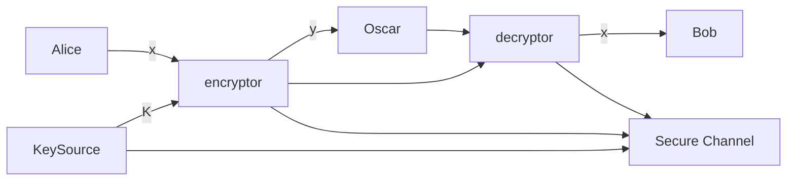

I begun reading the `Cryptography Theory and Practice` book by Stinson & Paterson
and I figured I would take notes, for those inclined to learn more about
cryptography. As a background, I am not a cryptographer. I'm an applier of
cryptography. So everything here will come from the lens of someone trying to
understand "how do I use this".

<!-- more -->

<!-- markdown-toc start - Don't edit this section. Run M-x markdown-toc-refresh-toc -->

**Table of Contents**

- [Introduction To Cryptography](#introduction-to-cryptography)
  - [Basic Crypto Systems](#basic-crypto-systems)
    - [Hybrid Cryptography](#hybrid-cryptography)
  - [Message Integrity](#message-integrity)
    - [Message Authentication Codes (MAC)](#message-authentication-codes-mac)
    - [Signature Schemes](#signature-schemes)
    - [Nonrepudiation](#nonrepudiation)
    - [Certificates](#certificates)
    - [Hashing](#hashing)
  - [Cryptographic Protocols](#cryptographic-protocols)
  - [Security](#security)
  - [Notes and References](#notes-and-references)
- [Classical Cryptography](#classical-cryptography)
  - [Introduction](#introduction)
    - [Shift Cipher](#shift-cipher)
    - [Substitution Cipher](#substitution-cipher)
    - [Affine Cipher](#affine-cipher)
    - [Vigenere Cipher](#vigenere-cipher)
    - [Hill Cipher](#hill-cipher)
    - [Permutations Cipher](#permutations-cipher)
    - [Stream Cipher](#stream-cipher)
    - [Autokey Cipher](#autokey-cipher)
  - [CryptAnalysis](#cryptanalysis)
    - [Affine Cipher](#affine-cipher-1)
    - [Vigenere Cipher](#vigenere-cipher-1)
    - [Hill Cipher](#hill-cipher-1)
    - [LFSR Stream Cipher](#lfsr-stream-cipher)
  - [Notes and References](#notes-and-references-1)

<!-- markdown-toc end -->

## Introduction To Cryptography

### Basic Crypto Systems

- In public private key encryption, a public key is used to encrypt the plaintext
  and the priate key is used to decrypt the text. The most widely known crypto
  system is RSA, invented by Rivest, Shamir and Adleman.
- Cryptosystems are usually categorized as block ciphers or stream ciphers.
  - Block cipher
    - Plain text is divided into fixed chunks a.k.a. **blocks**
    - Block is specified to be a bitstring of some length
    - Cipher will decrypt or encrypt one block at a time.
  - Stream Cipher
    - Constructs a key stream: a bitstring that has same length as the plaintext
    - Operation constructs the ciphertext as the exclusive-or of the plaintext
      and the keystream
    - Decryption is accomplished by computing the exclusive-or of the ciphertext
      and the keystream
  - Public-key cryptosystems are invariably block ciphers, while secret-key
    cryptosystems can be block ciphers or stream ciphers

#### Hybrid Cryptography

This method speeds up the drawbacks of slower public-key cryptosystems.

- Public key encryption for a short shared secret key
- Secret key encryption is used to encrypt longer plain text

### Message Integrity

- Secrecy == confidentiality
- Passive adversary ( can only listen in, but not alter data )
- Active adversary ( can alter, inpersonate, or divert information across a flow )
  - Mention of **bit-flipping attacks** as impacting stream ciphers
- Message Authentication Code (MAC) : secret key settings
- Public Key Settings use Signature Scheme. Roughly the same.

#### Message Authentication Codes (MAC)

- Alice uses a _secret key_ to create a _tag_ that she appends to the message
  (depends on both key and message).
- Bob uses the tag to re-compute the tag and checks to see if it is the same as
  the tag that he received.
- A variant is _encrypted-then-MAC_: Encrypt first, then tag

#### Signature Schemes

- Private key specifies a signing algo that can be used to sign messages.
- Output is called a signature
- Sign(msg, key)
- Verify(msg, signature)
- Anyone can verify signature
- It is infeasible for an adversary to create a signature
- Commonly used in software updates
- _sign-then-encrypt_ the reverse of _*encrypted-then-MAC*_

#### Nonrepudiation

- The concept not be able to take back a signature
- MAC is deniable and does not secure against repudiation.
- allows for secret conversation

#### Certificates

- Contains a websites public keys
- TA public key is typically hard coded into browser

#### Hashing

- Compresses arbirtrary length string into a fixed length `message-digest`
- After hash, signs the message digest `hash-then-sign`. Verification happens by
  comparing digest, then verification algorithm to check the validity of the
  signatures. `hash-then-sign-then-encrypt`.
- The crytographic hash is very different than a hash table:
  - hashtable: unprobable collisions
  - cryptographic: computationally infeasible to find collisions
- Cryptographic hashes can be used for key derivation
  - Hash applied to a long string to create a short random key
- Can't be used for encryption: no key and non-invertible/non-injective

### Cryptographic Protocols

- `protocol`: sequence of messages exchanged between two parties
- `session`: consists of one or many flows
- `identification scheme`: identity proof
- `key distribution scheme`: keys chosen by a trusted authority
- `key agreement` derived
- `secret sharing scheme` : involves a trusted authority distributing “pieces”
  of information (called “shares”) in such a way that certain subsets of shares
  can be suitably combined to reconstruct a certain predefined secret.
  - `threshold scheme`: (k,n)-threshold there are n shares and k permit
    reconstruction of the secret

### Security

- attack model, adversarial goal, and security level
- attack model: assumes information available to adversary
  - We will always assume that the adversary knows the scheme or protocol being
    used (this is called Kerckhoffs’ Principle).The adversary is also assumed to
    know the public key (if the system is a public-key system). On the other
    hand, the adversary is assumed not to know any secret or private keys being
    used
- adversarial goal: what does it mean for an attacker to be successful
- security level: qualify the effort to break the system
- 4 attack models:
  - `known ciphertext attack`: the adversary has access to some amount of
    ciphertext that is all encrypted with the same unknown key.
  - In a `known plaintext attack`, the adversary gains access to some plaintext as
    well as the corresponding ciphertext (all of which is encrypted with the
    same key).
  - In a `chosen plaintext attack`, the adversary is allowed to choose
    plaintext, and then they are given the corresponding ciphertext.
  - Finally, in a `chosen ciphertext attack`, the adversary chooses some
    ciphertext and they are then given the corresponding plaintext.
  - chosen models are stronger
- adverserial goal description
  - In a complete break of a cryptosystem, the adversary determines the private
    (or secret) key.
  - There are other, weaker goals that the adversary could potentially achieve,
    even if a complete break is not possible.
- Levels of security:
  - `computational security`, `provable security`, and `unconditional security`.
  - computational security: Computational security means that a specific
    algorithm to break the system is computationally infeasible, Quantum
    computing could really impact this
  - 1977 article said sipher would take 1 million years to break. It took 17 (
    better resources, improved algos, etc )
  - provable security aka _reductionist security_: breaking the cryptosystem
    (i.e., achieving the adversarial goal) can be reduced to a
    complexity-theoretic math problem.
  - unconditional security: can't be broken under any situation. One Time Pad
    problem.
- sometimes in protocols and combination flaws occurt that don't happen at the
  component level:
  - padding oracle attack (Vaudenay) uses padding as an attack vector
  - side channel attack : `timing attacks`, `fault analysis attacks`, `power analysis attacks`, and `cache attacks`

### Notes and References

- Everyday Cryptography : Fundamental Principles and Applications Keith Martin
- An Introduction to Mathematical Cryptography : Silverman et. al
- Introduction to Modern Cryptography : Katz
- Understanding Cryptography: A Textbook for Students and Practitioners : Paar
- Cryptography Made Simple : Smart
- A Classical Introduction to Cryptography: Applications for Communications
  Security : Vaudenay
- Mathematics of Public Key Cryptography : Galbraith
- Handbook of Applied Cryptography : Vanstone et. al

## Classical Cryptography

### Introduction

- Generally in cryptography, we use two actors `Alice` and `Bob`. The objective
  is that upon communication over an insecure `channel` in such a way that the
  opponent `Ocsar` cannot understand what was said.
- The cryptosystem is formally described as the following: (\$P\$, \$C\$, \$K\$, \$E\$, \$D\$)
  where the following are satisfied:
  - \$P\$ is a finite set of plaintexts
  - \$C\$ is a finite set of ciphertexts
  - \$K\$ is the keyspaceof possible keys
  - For each \$K \in K\$, there is an encryption rule \$ e_K \in E \$ and a corresponding
    decryption ruled \$ d_K \in D \$.Each \$ e_K :P \to C\$ and \$ d_K :C \to P\$ are functions such that
    \$d_K(e_K(x)) = x \$for every plaintext element \$x \in P\$.



- Steps:
  1. Randomly choose \$ k \in K \$. Message \$x\$ is a string that Alice wants
     to share. \$ x_i \in P, 1 \le i \le n \$. Each \$ x_i \$ is encrypted using
     the rule \$\epsilon_k\$ specified by the determined \$K\$.
  2. Alice will compute \$ y_i = e_k(x_i), 1 \lt i \lt n \$ which results in
     \$y\$.
  3. Bob receives and decrypts using \$d_k = x\$. Encryption function must be an
     injective function

#### Shift Cipher

```definition
  Let $P = C = \mathbb{Z}_{26}$ for $0 \lt K \lt 25,$
  <br>
  define
  <div class="equation section">
  $e_K(x) = (x + K)$ mod 26
  </div>
  and
  <div class="equation section">
  $d_K(y) = (y − K)$ mod 26
  </div>
  <div class="section">
  $(x,y) \in \mathbb{Z}_{26}$
  </div>
```

- Basic review: modular arithmetic
  - \$ a \equiv b \$ mod m if m divides \$ b-a \$. a is `congruent` to b modulo
    m. m is the modulus. Notation: a mod m to denote the remainder when a is
    divided by m. \$ a \equiv b \$ ifff a mod m = b mod m. replace a by a mod m
    we say a is reduced modulo m. In this book _mod is always in the positive
    direction_
- \$ m \: \mathbb{Z}\_m \$ is the set \$ \\{0,...,m-1\\}\$ with two ops: \$+\$
  and \$ \times \$. Results are reduced by modulo m after standard ops.
  - ex. 11 x 13 in \$\mathbb{Z}\_{16}\ = 15$
  * addition is `closed`, i.e.,for any \$a,b \in \mathbb{Z}\_m,a+b\in \mathbb{Z}\_m\$
  * addition is `commutative`, i.e.,\$a,b \in \mathbb{Z}\_m,a+b = b+a\$
  * addition is `associative`, i.e.,\$a,b,c \in \mathbb{Z}\_m,(a+b) + c = a+(b+c)\$
  * 0 is an `additive identity`, i.e.,\$a \in \mathbb{Z}\_m,a+0= 0+a=a\$
  * the `additive inverse` of any \$a \in \mathbb{Z}\$ is \$ m-a \$ i.e \$a +
    (m-a) = (m-a)+a=0\$ for any \$a \in \mathbb{Z}\_m\$
  * multiplication is `closed`, i.e.,for any \$a,b \in \mathbb{Z}\_m,ab\in \mathbb{Z}\_m\$
  * muliplication is `commutative`, i.e.,\$a,b \in \mathbb{Z}\_m,ab = ba\$
  * muliplication is `associative`, i.e.,\$a,b,c \in \mathbb{Z}\_m,(ab)c = a(bc)\$
  * 1 is an `multiplicative identity`,i.e.,\$a \in \mathbb{Z}\_m,a \times 1= 1
    \times a=a\$
  * the `distributive property` of any \$a,b,c \in \mathbb{Z}, (a+b)c =
    (ac)+(bc)\$ and \$a(b+c) = (ab) + (ac)\$
- The closed, associative, additive identity, additive inverse create a **group**
- If also commutative, it is called an **abelian group**
- All properties establish a \$\mathbb{Z_m}\$ is a **ring**
- Shift cipher (encryption):
  1. Convert each character A-Z to 0-16
  2. Add it by K and take the mod 26
  3. Convert to characters
- Decryption
  1. Convert each character A-Z to 0-16
  2. Subtract it by K and take the mod 26
  3. Convert to characters
- Note: habit of doing cypertext as uppercase and plaintext as lowercase
- This is a weak crypto method, b/c `exhaustive key search` only requires 26 keys

#### Substitution Cipher

```definition
<div class="section">Let $P = C = \mathbb{Z}_{26}$.</div>
<div class="section">
$K$ consists of all possible permutations of the 26 symbols
0,1,...,25. For each permutation $\pi \in K$, define
</div>
<div class="section equation">
  $\epsilon_{\pi}(x) = \pi(x)$
</div>
<div class="section equation">
  $ d_{\pi}(y) = \pi^{-1}(y)$
</div>
where π−1 is the inverse permutation to $\pi$.
```

- Basically, choose some random substitutions and then use the mapping to
  compute the inverse. 26! That's \$4x10^{26}\$ combinations. Infeasible to
  compute through exhaustive search, but there's other ways to break this.

#### Affine Cipher

```definition
Let $P = C = \mathbb{Z}_{26}$ and let
<div class="section equation">
$K = {(a,b) \in \mathbb{Z}_{26} ×\mathbb{Z}_{26} : gcd(a,26) = 1}$
</div>
For $K = (a, b) \in K$, define
<div class="section equation">
  $e_K(x) = (ax + b)$ mod 26
</div>
and
<div class="section equation">
  $d_K(y) = a^{-1}(y-b)$ mod 26
</div>
$(x, y \in \mathbb{Z}_{26})$.
```

- restrict sub cipher to : $e(x) = (ax + b)$ mod 26
- requirement: injective
- \$gcd(4,26) = 2\$ therefore 2 solutions (x and x+13) will work. Non-injective.

```theorem
The congruence $ax \equiv b$ (mod m) has a unique solution $x \in \mathbb{Z}_m$ for every $b \in \mathbb{Z}_m$ if and only if $gcd(a,m) = 1$.
```

- \$ax \equiv y \$ (mod 26) has only one solution if \$gcd(a,26)=1\$

```definition
Suppose $a \geq 1$ and $m \geq 2$ are integers. If $gcd(a, m) = 1$, then we say that a and m
are relatively prime. The number of integers in $\mathbb{Z}_m$ that are relatively prime to
m is often denoted by $\phi(m)$ -- Euler phi function.
```

- takaway: primes are used to ensure injectivity
- You can do the same with multipliers.
  - ex. \$60 = 22 \times 31 \times 51\$ to \$\phi(60) = (4−2)\times(3−1)\times(5−1) = 2\times2\times4 = 16\$

```definition
Suppose $a \in \mathbb{Z}_m$. The multiplicative inverse of a modulo m, denoted $a^1$ mod m, is an element $a' \in \mathbb{Z}_m$ such that $aa' \equiv a'a \equiv 1$ (mod m). If m is fixed, it can be written as $a^1$ for $a^1$ mod m.
```

- [ ] A ring where if p is prime, then every non-zero element of \$\mathbb{Z}\_p\$
      has a multiplicative inverse. This is called a `field`.
  - \$7x15=105 \equiv 1 \$ (mod 26) so \$7^{-1} = 15\$ and \$ 15^{-1} = 7\$

#### Vigenere Cipher

```definition
Let $m$ be a positive integer. Define $P = C = K = \mathbb{Z}_{26}^{m}.$
<p>For key $K = (k_1, k_2, ..., k_m)$ we defined:
<div class="equation section">
  $e_K(x_1,x_2,...,x_m) = (x_1 +k_1,x_2 +k_2,...,x_m +k_m)$
</div>
and
<div class="equation section">
  $d_K(y_1,y_2,...,y_m) = (y_1 - k_1, y_2 - k_2,...,y_m - k_m )$
</div>
Where all operations are performed on $\mathbb{Z}_{26}$
</p>
```

- shift and cipher are `monoalphabetic cryptosystems`, 1:1 key mapping
- K with alphabet string of len \$m\$ called a _keyword_. It encrypts a block at
  a time.
- Add the keyword to plaintext in blocks
- \$26^{m}\$ combinations
- `polyalphabetic cryptosystem`: one character to many. Generally harder to solve.

#### Hill Cipher

```definition
Let $m \geq 2$ be an integer. Let $P = C = \mathbb{Z}_{26}^{m}$ and let

<div class="equation">
  $K = \{m × m$ invertible matrices over $\mathbb{Z}_{26}\}$
</div>

For a key $K$ we derive:

<div class="equation">
  $e_K(x) = xK$
</div>

and

<div class="equation">
  $d_K(y) = yK^{-1}$
</div>

where all operations are performed in $\mathbb{Z}_{26}$.
```

- Idea: take \$m\$ linear combinations of the \$m\$ alphabetic characters in the
  plaintext, which produces \$m\$ alphabetic characters in one ciphertext element.
- \$y = xK\$
- linear tranformation and decryption is just the inverse \$x = yK^{-1}\$
- matrix product. Standard linear algebra stuff but with modular math.
  \$c\_{i,k} = \sum{a\_{i,j} ,b\_{i,j}} \$
- july = K(3,4),K(11,22) where K is a 2x2 matrix
- decryption: use the inverse.

```definition
Determinant is a scalar value that is a function of the entries of a square matrix. It characterizes some properties of the matrix and the linear map represented by the matrix
<div class="equation">
$det A = \sum(-1)^{i+j}a_{i,j}detA_{i,j}$
</div>
```

- The inverse will exist if determininant is non-zero.
- K\* the `adjoint matrix` of K

```theorem
Suppose $K = (k_{i,j})$ is an $m × m$ matrix over $\mathbb{Z}_{26}$ such that det K is
invertible in $\mathbb{Z}_{26}$. Then $K^{−1} = (det K)^{−1}K^{*}$, where $K^{*}$ is the adjoint matrix of K
```

```todo
Review this
```

#### Permutations Cipher

```definition

Let $m$ be a positive integer. Let $P = C = \mathbb{Z}_{26}^m$ and let $K$ consist of all permutations of $\{1,...,m\}$. For a key $\pi$, we define:

<div class="equation">
  $e_{\pi}(x_1,...,x_n) = (x_{\pi}^1,...,x_{\pi}^n)$
</div>

<div class="equation">
  $d_{\pi}(y_1,...,y_n) = (y_{\pi}^1,...,y_{\pi}^n)$
</div>

where $\pi^-1$ is the inverse permutation of $\pi$
```

- Plain text unchanged, just ordering changed.
- \$\pi \: X \to X\$ injective and surjective function so \$\pi^{-1} \: X \to X\$
- A special case of the hills cipher. Just change the ordering into a matrix.

#### Stream Cipher

- Given a key stream \$z = z_1 z_2... \to x = x_1 x_2...\$
- Synchronous stream cipher the simpliest.

```definition
A synchronous stream cipher is a tuple $(P, C, K, L, E, D)$, together with a function g, such that the following conditions are satisfied:

<ol>
<li> $P$ is a finite set of possible plain texts</li>
<li> $C$ is a finite set of cyphertexts</li>
<li> $K$, the keyspace, is a finite set of possible keys</li>
<li> $L$ is a finite set called the keystream alphabet</li>
<li> $g$ is the keystream generator. $g$ takes a key $K$ as input, and generates an infinite string z1z2 ... called the keystream, where $z_i \in L$ for all $i ≥ 1$.</li>
<li> For each $z \in L$, there is an encryption rule $e_z \in E$ and a corresponding decryption rule $d_z \in D$. $e_z \:P \to C$ and $d_z \:C \to P$ are functions such that $d_z(e_z(x)) = x$ for every plaintext element $x \in P$.</li>
</ol>
```

- `periodic stream cipher` with period d if $z_{i+d} = z_i$ for all integers $i
  \geq 1$. For example, Vigenere Cipher, the period is m, the length of the
  keyword, the period is m, the length of the keyword, the period is m, the
  length of the keyword, the period is m, the length of the keyword.
- Often stream ciphers are described in terms of binary alphabets. Exlusive is
  modulus or. \$e_z(x) = (x + z) mod 2\$ and \$d_z(y) = (y + z) mod 2\$
- generate keystream using linear recurrence of degree m.
- linear feedback shift register (LFSR)

**Sample Script**

```python
# Example 2.8
# an implementation a linear recurrence example
x = bin(8)
m,l= 4,2
for i in range(20):
    x_v = x[-m:]
    x += str(x_v[:2].count( "1" ) % 2)
return x
# result
#: 0b100010011010111100010011
```

#### Autokey Cipher

- `non-synchronous stream cipher` each stream cipher in which each keystream
  element zi depends on previous plaintext or ciphertext element as well as the
  key.

```definition
Let $P=C=K=L\mathbb{Z}_{26}$ Let $z_1 =K$ and define $z_i = x_{i−1}$ and $\forall{i \geq 2}$.
For $0 \leq z \leq 25$ define

<div class="equation">
</div>

<div class="equation">
  $e_z(x) = (x + z)$ mod 26
</div>

<div class="equation">
  $d_z(y) = (y - z)$ mod 26
</div>


$(x, y \in \mathbb{Z}_{26})$.
```

**Sample script**

```python
# Example 2.9
# Autocipher Key example
mod = 26

class AutoKeyCipher():

    def __init__(self, K):
        self._K = K
        self.enc_k = K
        self.dec_k = K

    def encrypt(self, x):
        y = (self.enc_k+x)%mod
        self.enc_k = x
        return y

    def decrypt(self, x):
        z = (x-self.dec_k) % mod
        self.dec_k = z
        return z


plaintext = [17,4,13,3,4,25,21,14,20,18]
cipher = AutoKeyCipher(K=8)
enc = [cipher.encrypt(x) for x in plaintext]
dec = [cipher.decrypt(x) for x in enc]
return enc, dec

# result:
# | 25 | 21 | 17 | 16 | 7 |  3 | 20 |  9 |  8 | 12 |
# | 17 |  4 | 13 |  3 | 4 | 25 | 21 | 14 | 20 | 18 |
```

### Cryptanalysis

Oscar knows the crypto system being used as `Kerckhoffs’ Principle`.

- 4 attack models:
  - `known ciphertext attack`: the adversary has access to some amount of
    ciphertext that is all encrypted with the same unknown key. Weakest type of attack.
  - In a `known plaintext attack`, the adversary gains access to some plaintext as
    well as the corresponding ciphertext (all of which is encrypted with the
    same key).
  - In a `chosen plaintext attack`, the adversary is allowed to choose
    plaintext, and then they are given the corresponding ciphertext.
  - Finally, in a `chosen ciphertext attack`, the adversary chooses some
    ciphertext and they are then given the corresponding plaintext.
  - chosen models are stronger
- adverserial goal description
  - In a complete break of a cryptosystem, the adversary determines the private
    (or secret) key.
  - There are other, weaker goals that the adversary could potentially achieve,
    even if a complete break is not possible.

#### Affine Cipher

#### Vigenere Cipher

#### Hill Cipher

#### LFSR Stream Cipher

### Notes and References
