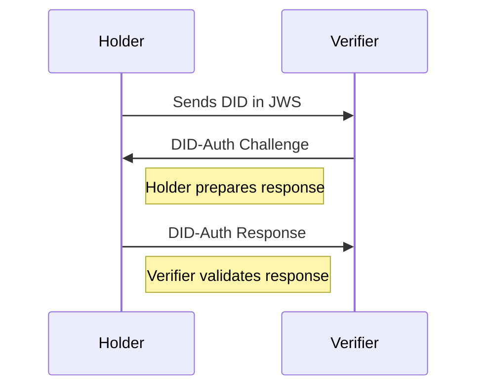

#### What is DID Auth?

DID Authentication (DID Auth) is the mechanism by which an entity can
cryptographically prove that they are associated with a DID and DID Description.

<!--more -->

DID auth is more a concept than an implementation, with a widely known
implementations hanging around today, such as:

- [SIOP](https://identity.foundation/did-siop/#:~:text=This%20specification%20defines%20the%20%22SIOP,Identity%20Wallets%20into%20their%20web)
- [OIDC](https://openid.net/connect/)
- [OIDC4VCI](https://openid.net/specs/openid-4-verifiable-credential-issuance-1_0.html)
- [OIDC4VP](https://openid.net/specs/openid-connect-4-verifiable-presentations-1_0-07.html)

I wanted to understand the underlying mechanics of DID Auth better, so I ended
up putting together a hello world implementation of DID Auth.

The best reference I found was
[here](https://w3c-ccg.github.io/vp-request-spec/). This tutorial will go
through the basics and there is associated code alongside it.

#### Putting it together

Let's assume you have a sample did:

`did:key:z6Mkq7ULXu5zD18Zmfxgd24d2ceR3cPjapRQtoGEb36pVUTE`

This resolves to the following did document:

_DID Document_

---

```sh
{
   "@context": "https://www.w3.org/ns/did/v1",
   "id": "did:key:z6Mkq7ULXu5zD18Zmfxgd24d2ceR3cPjapRQtoGEb36pVUTE",
   "verificationMethod": [
      {
         "id": "#z6Mkq7ULXu5zD18Zmfxgd24d2ceR3cPjapRQtoGEb36pVUTE",
         "type": "Ed25519VerificationKey2018",
         "controller": "did:key:z6Mkq7ULXu5zD18Zmfxgd24d2ceR3cPjapRQtoGEb36pVUTE",
         "publicKeyBase58": "BfDHweqYsTe6fB7ywT6nBX6RE37tAwB4CnMJkm8oaFfr"
      }
   ],
   "authentication": [
      [
         "#z6Mkq7ULXu5zD18Zmfxgd24d2ceR3cPjapRQtoGEb36pVUTE"
      ]
   ],
   "assertionMethod": [
      [
         "#z6Mkq7ULXu5zD18Zmfxgd24d2ceR3cPjapRQtoGEb36pVUTE"
      ]
   ],
   "keyAgreement": [
      [
         "#z6Mkq7ULXu5zD18Zmfxgd24d2ceR3cPjapRQtoGEb36pVUTE"
      ]
   ],
   "capabilityDelegation": [
      [
         "#z6Mkq7ULXu5zD18Zmfxgd24d2ceR3cPjapRQtoGEb36pVUTE"
      ]
   ]
}
```

We want to be able to prove that you in fact, are the controller of the did. In
other words, how does the holder **prove** they in fact hold the did.

This is where DIDAuth comes in. It's a concept, not an implementation, that
relies along a challenge, response and cryptography to prove facts.

Let's assume the basic flow, challenge and response.



#### Preparing the Challenge

In a DID Auth interaction, a challenge is transmitted by a relying party to an
identity owner, asking the identity owner to return a response that proves their
control of a DID. In this case, the relying party is the _verifier_ and the
identity owner is the _holder_.

Similar to other authentication methods, DID Auth relies on a challenge-response
cycle in which a relying party authenticates the DID of an identity owner.
During this cycle, an identity owner demonstrates control of their DID through
authentication-proof mechanisms.

Example Challenge

```json
{
  "query": [
    {
      "type": "DIDAuthentication",
      "acceptedMethods": [{ "method": "key" }],
      "acceptedCryptosuites": [{ "cryptosuite": "ed25519" }]
    }
  ],
  "challenge": "99612b24-63d9-11ea-b99f-4f66f3e4f81a",
  "domain": "example.com"
}
```

Here we generate a `challenge` ( i find it easier to think of a nonce ), which a
one time seed used to help sign.

Learn more about the challenge format [here](https://w3c-ccg.github.io/vp-request-spec/#the-did-authentication-query-format)

You might also notice a `domain` field. In practice, this field needs to be
checked to validate ownership of the domain.

```blockquote
It is vital that a holder implementation check the domain provided by the
verifier against the domain used for the current channel of communication. If
this is not done, a dishonest verifier could then replay the message to a
domain that is not their own.
```

To follow up: Relying on a domain for verification seems wrong. I will need to
review this some more.

#### Preparing Response

The response prepared by the holder must be in the form of a verifiable
presentation in the following form below:

```json
{
  "@context": ["https://www.w3.org/2022/credentials/v2"],
  "type": "VerifiablePresentation",
  "holder": "did:example:12345",
  "proof": {
    "type": "DataIntegrityProof",
    "cryptosuite": "eddsa-2022",
    "verificationMethod": "did:example:12345#key-1",
    "challenge": "99612b24-63d9-11ea-b99f-4f66f3e4f81a",
    "domain": "example.com",
    "created": "2022-02-25T14:58:42Z",
    "proofPurpose": "authentication",
    "proofValue": "z3FXQjecWufY46...UAUL5n2Brbx"
  }
}
```

The proof is generated

#### Response Validation

#### Extending the concept with Verifiable Credentials

#### Additional Resources

- [Sphereon has a great SoIP-v2 library](https://github.com/Sphereon-Opensource/SIOP-OpenID4VP)
- [More protocol specifications here](https://github.com/WebOfTrustInfo/rwot6-santabarbara/blob/master/topics-and-advance-readings/DID-Auth%20protocol.md)
- [SIOP](https://identity.foundation/did-siop/)
- [OIDC](https://openid.net/connect/)
- [OIDC4VCI](https://openid.net/specs/openid-4-verifiable-credential-issuance-1_0.html)
- [OIDC4VP](https://openid.net/specs/openid-connect-4-verifiable-presentations-1_0-07.html)

#### Code

The code for this resides in [github.com/benri-io/did_auth_demo](https://github.com/benri-io/did_auth_demo).
