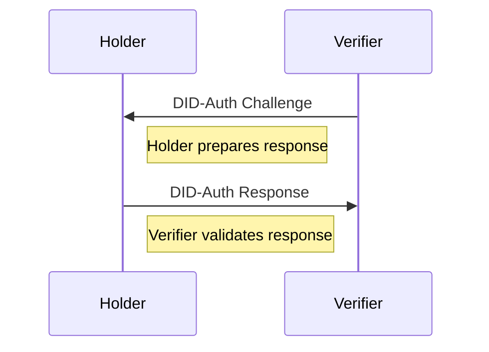

\*_Status:_ Work in Progress

#### What is DID Auth?

DID Authentication (DID Auth) is the mechanism by which an entity can
cryptographically prove that they are associated with a DID and DID Description.

<!--more -->

<!-- markdown-toc start - Don't edit this section. Run M-x markdown-toc-refresh-toc -->

**Table of Contents**

- [What is DID Auth?](#what-is-did-auth)
- [Putting it together](#putting-it-together)
- [Preparing the Challenge](#preparing-the-challenge)
- [Preparing Response](#preparing-response)
- [Response Validation](#response-validation)
- [Extending the concept with Verifiable Credentials](#extending-the-concept-with-verifiable-credentials)
- [Things Not Covered](#things-not-covered)
- [Additional Resources](#additional-resources)
- [Code](#code)

<!-- markdown-toc end -->

DID auth is more a concept than an implementation, with a widely known
implementations hanging around today, such as:

- [SIOP](https://identity.foundation/did-siop/#:~:text=This%20specification%20defines%20the%20%22SIOP,Identity%20Wallets%20into%20their%20web)
- [OIDC](https://openid.net/connect/)
- [OIDC4VCI](https://openid.net/specs/openid-4-verifiable-credential-issuance-1_0.html)
- [OIDC4VP](https://openid.net/specs/openid-connect-4-verifiable-presentations-1_0-07.html)

I wanted to understand the underlying mechanics of DID Auth better, so I ended
up putting together a hello world implementation of DID Auth.

The best reference I found was
[here](https://w3c-ccg.github.io/vp-request-spec/). This tutorial will go
through the basics and there is associated code alongside it. Another great
reference was [this video](https://ssimeetup.org/introduction-did-auth-markus-sabadello-webinar-10/).

#### Putting it together

Let's assume you have a sample did:

`did:key:z6Mkq7ULXu5zD18Zmfxgd24d2ceR3cPjapRQtoGEb36pVUTE`

This resolves to the following did document:

_DID Document_

---

```sh
{
   "@context": "https://www.w3.org/ns/did/v1",
   "id": "did:key:z6Mkq7ULXu5zD18Zmfxgd24d2ceR3cPjapRQtoGEb36pVUTE",
   "verificationMethod": [
      {
         "id": "#z6Mkq7ULXu5zD18Zmfxgd24d2ceR3cPjapRQtoGEb36pVUTE",
         "type": "Ed25519VerificationKey2018",
         "controller": "did:key:z6Mkq7ULXu5zD18Zmfxgd24d2ceR3cPjapRQtoGEb36pVUTE",
         "publicKeyBase58": "BfDHweqYsTe6fB7ywT6nBX6RE37tAwB4CnMJkm8oaFfr"
      }
   ],
   "authentication": [
      [
         "#z6Mkq7ULXu5zD18Zmfxgd24d2ceR3cPjapRQtoGEb36pVUTE"
      ]
   ],
   "assertionMethod": [
      [
         "#z6Mkq7ULXu5zD18Zmfxgd24d2ceR3cPjapRQtoGEb36pVUTE"
      ]
   ],
   "keyAgreement": [
      [
         "#z6Mkq7ULXu5zD18Zmfxgd24d2ceR3cPjapRQtoGEb36pVUTE"
      ]
   ],
   "capabilityDelegation": [
      [
         "#z6Mkq7ULXu5zD18Zmfxgd24d2ceR3cPjapRQtoGEb36pVUTE"
      ]
   ]
}
```

We want to be able to prove that you in fact, are the controller of the did. In
other words, how does the holder **prove** they in fact hold the did.

This is where DIDAuth comes in. It's a concept, not an implementation, that
relies along a challenge, response and cryptography to prove facts.

Let's assume the basic flow, challenge and response.



#### Preparing the Challenge

In a DID Auth interaction, a challenge is transmitted by a relying party to an
identity owner, asking the identity owner to return a response that proves their
control of a DID. In this case, the relying party is the _verifier_ and the
identity owner is the _holder_.

Similar to other authentication methods, DID Auth relies on a challenge-response
cycle in which a relying party authenticates the DID of an identity owner.
During this cycle, an identity owner demonstrates control of their DID through
authentication-proof mechanisms.

Example Challenge

```json
{
  "query": [
    {
      "type": "DIDAuthentication",
      "acceptedMethods": [{ "method": "key" }],
      "acceptedCryptosuites": [{ "cryptosuite": "ed25519" }]
    }
  ],
  "challenge": "99612b24-63d9-11ea-b99f-4f66f3e4f81a",
  "domain": "example.com"
}
```

There are few really interesting things here. Firstly, let us notice that in
this challenge, the DID of the holder is not present. That may seem unintuitive,
because you would expect that to prove you own the did, you would need to also
share the did value, but that is not required. It also does not necessarily show
that the relying party owns a DID frm their! Another curveball here.

Second: we generate a `challenge` ( i find it easier to think of a nonce ), which a
one time seed used to help sign. Learn more about the challenge format [here](https://w3c-ccg.github.io/vp-request-spec/#the-did-authentication-query-format)

Third might also notice a `domain` field. According to the w3c, it needs to be
checked to validate ownership of the domain.

```blockquote
It is vital that a holder implementation check the domain provided by the
verifier against the domain used for the current channel of communication. If
this is not done, a dishonest verifier could then replay the message to a
domain that is not their own.
```

I'm not sure I buy this yet as the right way to do it. I'll need to follow up
more. Relying on a domain for verification seems wrong.

#### Preparing Response

A response is what the holder prepares to the verifier to show they own the did.
The response has a few critical features to it. Firstly, it MUST be linked to
the challenge ( using the Nonce ) and secondly it MUST contain proof of control
of the DID of the holder.

The w3c specs demonstrate the response in a verifiable presentation of the
following form below:

```json
{
  "@context": ["https://www.w3.org/2022/credentials/v2"],
  "type": "VerifiablePresentation",
  "holder": "did:example:12345",
  "proof": {
    "type": "DataIntegrityProof",
    "cryptosuite": "eddsa-2022",
    "verificationMethod": "did:example:12345#key-1",
    "challenge": "99612b24-63d9-11ea-b99f-4f66f3e4f81a",
    "domain": "example.com",
    "created": "2022-02-25T14:58:42Z",
    "proofPurpose": "authentication",
    "proofValue": "z3FXQjecWufY46...UAUL5n2Brbx"
  }
}
```

In the code sample shared, I used JSONWebSignatures to verify and create the proofs.

```json
{
  "@context": [
    "https://www.w3.org/2018/credentials/v1",
    "https://w3id.org/security/suites/jws-2020/v1"
  ],
  "holder": "did:key:z6Mks7tCEjXLYG1eZPxeLriwV2fserei72A2KUAMRb1nff7G",
  "type": "VerifiablePresentation",
  "proof": {
    "type": "JsonWebSignature2020",
    "created": "2022-11-24T22:44:33Z",
    "jws": "eyJhbGciOiJFZERTQSIsImI2NCI6ZmFsc2UsImNyaXQiOlsiYjY0Il19..QJDhf5cwCzuPOzOIebUQOopr6dEUx0QvwPYKKZ73NMDnIeQrM_5QFHJ8bmZEWtSNtY4z5JBP5eT2zH_FOnzHBw",
    "proofPurpose": "DIDAuthentication",
    "verificationMethod": "603621dc-c251-466d-9b66-e2e31eae40ab"
  }
}
```

The public key is leveraged to validate the proof. You can see a test, where a
bad actor tries to pretend to own the key [here](https://github.com/benri-io/did_auth_demo/blob/master/did_auth_test.go#L95-L118)

#### Response Validation

Validating the proof involves using a verifying algorithm.

#### Things Not Covered

- I consider transports an implementation detail, and out of scope for this
  document. Maybe in a future one.
- The details of the cryptographic proofs and how they work are a little too low
  level for this article.
- I did not go into practical implementations of DID Auth. This was focused
  mostly on being super clear.
- Data formats such as JWT, JSON-LD, HTTP Signatures, and JWS

#### Additional Resources

- [Sphereon has a great SoIP-v2 library](https://github.com/Sphereon-Opensource/SIOP-OpenID4VP)
- [More protocol specifications here](https://github.com/WebOfTrustInfo/rwot6-santabarbara/blob/master/topics-and-advance-readings/DID-Auth%20protocol.md)
- [SIOP](https://identity.foundation/did-siop/)
- [OIDC](https://openid.net/connect/)
- [OIDC4VCI](https://openid.net/specs/openid-4-verifiable-credential-issuance-1_0.html)
- [OIDC4VP](https://openid.net/specs/openid-connect-4-verifiable-presentations-1_0-07.html)

#### Code

The code for this resides in [github.com/benri-io/did_auth_demo](https://github.com/benri-io/did_auth_demo).
