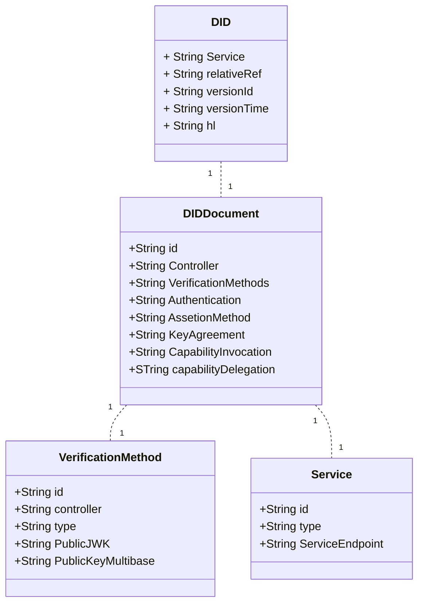
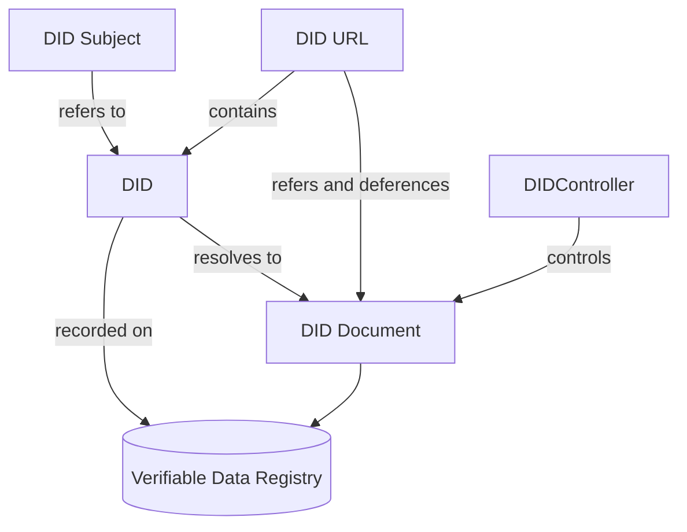
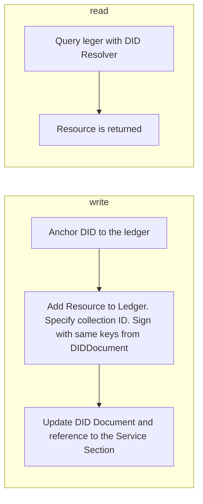

<!-- more -->
<!-- markdown-toc start - Don't edit this section. Run M-x markdown-toc-refresh-toc -->

**Table of Contents**

- [What really is a DID?](#what-really-is-a-did)
- [What is a DID's ( Part 2 )?](#what-is-a-dids--part-2-)
- [What problems are DID's trying to solve](#what-problems-are-dids-trying-to-solve)
- [Ways to Leverage A DID](#ways-to-leverage-a-did)
  - [DID Anchoring](#did-anchoring)
- [Privacy Considerations](#privacy-considerations)
- [Additional Resources](#additional-resources)

<!-- markdown-toc end -->

I was having a conversation in the Trust Over IP Technical Architecture Group
which got relatively heated, because it was centered around something very
fundamental to decentralized identity: **DIDs**. As the most basic building
block to SSI, the conversation highlighted a few things:

```note
The fact there was a discussion around it to me indicates a lack of clarity
```

### What's a DID?

If you go to the [w3c website](https://www.w3.org/TR/did-core/), the official spec definition is the following:

```blockquote
Decentralized identifiers (DIDs) are a new type of identifier that enables verifiable, decentralized digital identity. A DID refers to any subject (e.g., a person, organization, thing, data model, abstract entity, etc.) as determined by the controller of the DID. In contrast to typical, federated identifiers, DIDs have been designed so that they may be decoupled from centralized registries, identity providers, and certificate authorities. Specifically, while other parties might be used to help enable the discovery of information related to a DID, the design enables the controller of a DID to prove control over it without requiring permission from any other party. DIDs are URIs that associate a DID subject with a DID document allowing trustable interactions associated with that subject.

Each DID document can express cryptographic material, verification methods, or services, which provide a set of mechanisms enabling a DID controller to prove control of the DID. Services enable trusted interactions associated with the DID subject. A DID might provide the means to return the DID subject itself, if the DID subject is an information resource such as a data model.

This document specifies the DID syntax, a common data model, core properties, serialized representations, DID operations, and an explanation of the process of resolving DIDs to the resources that they represent.
```

One of the challenges that I've noticed with the spec is that, while technically
accurate, the intent of the specs are entirely clear, particluarly for someone
trying to understand how to use a DID in the field. So, I'd like to take a step
back and ask two fundamental questions:

- **What problem are DIDs trying to solve**
- **How Can I Use a DID?**

### What really is a DID?

Let's start with what is a DID. I think one of the anologies I've heard that
might make a lot of sense is that DID's are like URLs, only better. Think of
URL+. In fact, one of the DID methods `did:web` is basically a reference to a
webpage that contains a did document. So what are DID Documents? DID Documents
are documents containing a "trust context" to maintain an interaction. It
describes things like: How do I prove who owns this DID ( using cryptography )
or what services associated with that person ( for example, a social network
endpoint.)

Here's a model of a DID.

#### What a DID looks like

A DID, from a structural level, is represented as a string and takes the
following form:

`<scheme>:<method>:<method-specifier>`
did:example:1234567789asdfghji

At a more detailed level, here are the models in a DID.



For [references](https://www.w3.org/TR/did-core/#terminology).

#### DID Design

- Decentralized
- Full control
- Privacy
- Security
- Proof based
- Discoverability
- Interoperability
- Portability
- Simplicity
- Extensibility

#### Required Fields

Let's first take a look at the required field for a DID.

#### How DID's Work in the field



### What problems are DID's trying to solve

Lets start about what problems DID ( along with VCs ) are trying to solve.

## Ways to Leverage A DID

### DID Anchoring



## Privacy Considerations

With how DID's get handled in a privacy perserving manner, there's really no
normative standards on this. Basically, there's a lot of "wiggle" room on how to
manage a DID and how to use it. That being said, I've compiled a list of a few
bullets for how to manage a DID right. Thanks to Jo from Seezo for shooting some
great articles down my way.

Here are some key tenants of [privacy by design](https://iapp.org/media/pdf/resource_center/pbd_implement_7found_principles.pdf):

- Proactive not Reactive; Preventative not Remedial
- Privacy as the Default Setting
- Privacy Embedded into Design
- Full Functionality – Positive-Sum, not Zero-Sum
- End-to-End Security – Full Lifecycle Protection
- Visibility and Transparency – Keep it Open
- Respect for User Privacy – Keep it User-Centric

###

- DIDs should be handled by the DID Controller
-

## Additional Resources
