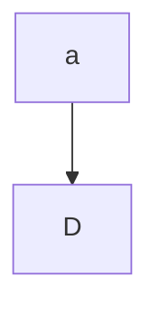

Hello world. This is a fun little side project I've decided to cook up on my
spare time.

<!--more-->

### Blog Engineering Details

#### Hugo

This blog is built in [hugo](https://gohugo.io/), an amazing static site
generator for building websites. I run the styling over
[scss](https://sass-lang.com/). As of this time, I've stylized this hugo website
a theme I created [mimicking doom emacs
solaries](https://github.com/andorsk/emacsTheme).

#### Hosting

This is hosted with a nginx controller.

### Creating the Doom Emacs Theme

If you want to create a theme from scratch, I would recommend going to [Creating
a Hugo Theme From Scratch](https://retrolog.io/blog/creating-a-hugo-theme-from-scratch/). This was
my first time building a theme in hugo, and it's a great place to start.

For styling, a lot of it was trial and error. I'm not a big frontend/css guy, so
it probably took more work than an experienced front end css developer.

### Rendering Mermaid.js



<div class="mermaid">
  {{- .Inner | safeHTML }}
  graph TD
</div>
{{ .Page.Store.Set "hasMermaid" true }}

### Code Highlighting


func Test(t \*testing.T){
This is a test
}


### Things To Do

- Locking some files behind a permissions layer
- d2 discussion
- some credential stuff

```goat
      .               .                .               .--- 1          .-- 1     / 1
     / \              |                |           .---+            .-+         +
    /   \         .---+---.         .--+--.        |   '--- 2      |   '-- 2   / \ 2
   +     +        |       |        |       |    ---+            ---+          +
  / \   / \     .-+-.   .-+-.     .+.     .+.      |   .--- 3      |   .-- 3   \ / 3
 /   \ /   \    |   |   |   |    |   |   |   |     '---+            '-+         +
 1   2 3   4    1   2   3   4    1   2   3   4         '--- 4          '-- 4     \ 4

```

```goat
  o o o o o  * * * * *  * * o o *    o o o      * * *      o o o     · * · · ·     · · ·
  o o o o o  * * * * *  o o o o *   o o o o    * * * *    * o * *    · * * · ·    · · · ·
  o o o o o  * * * * *  o * o o o  o o o o o  * * * * *  o o o o o   · o · · o   · · * * ·
  o o o o o  * * * * *  o * o o o   o o o o    * * * *    o * o o    · · · · o    · · * ·
  o o o o o  * * * * *  * * * * o    o o o      * * *      o * o     · · · · ·     · · *
```

{{ if .Page.Store.Get "hasMermaid" }}

  <script src="https://cdn.jsdelivr.net/npm/mermaid/dist/mermaid.min.js"></script>
  <script>
    mermaid.initialize({ startOnLoad: true });
  </script>

{{ end }}
